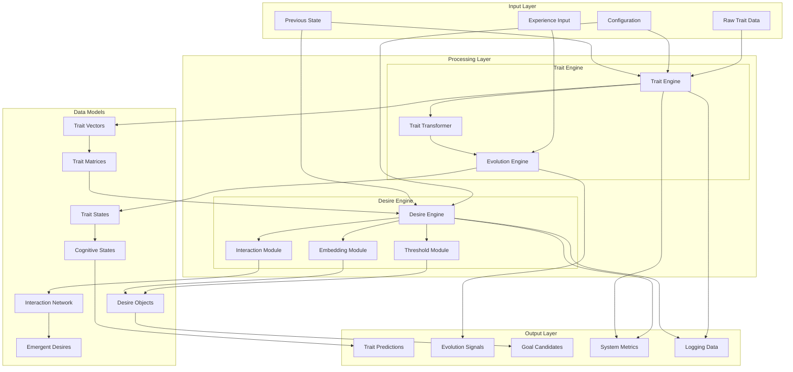
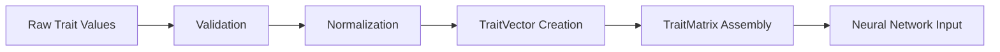
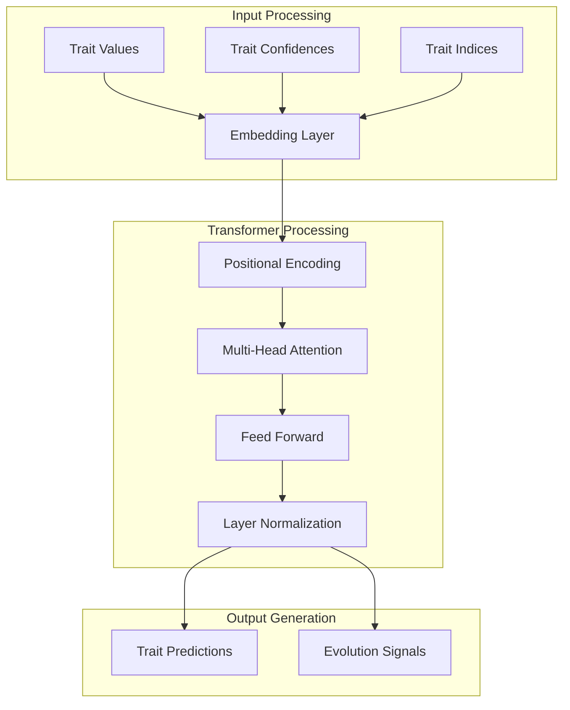
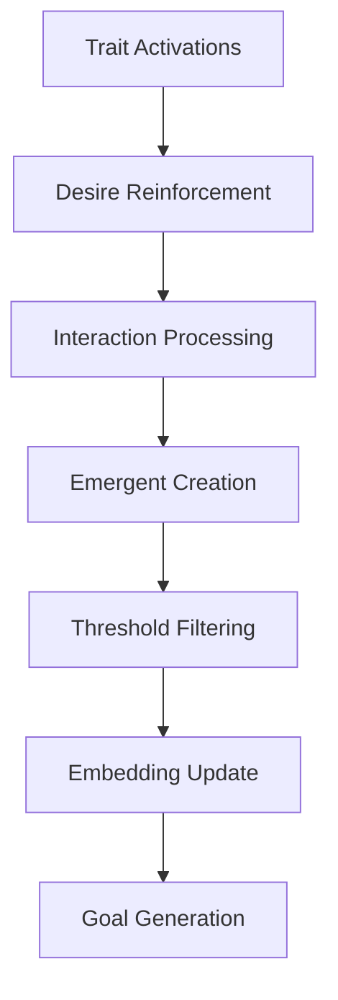
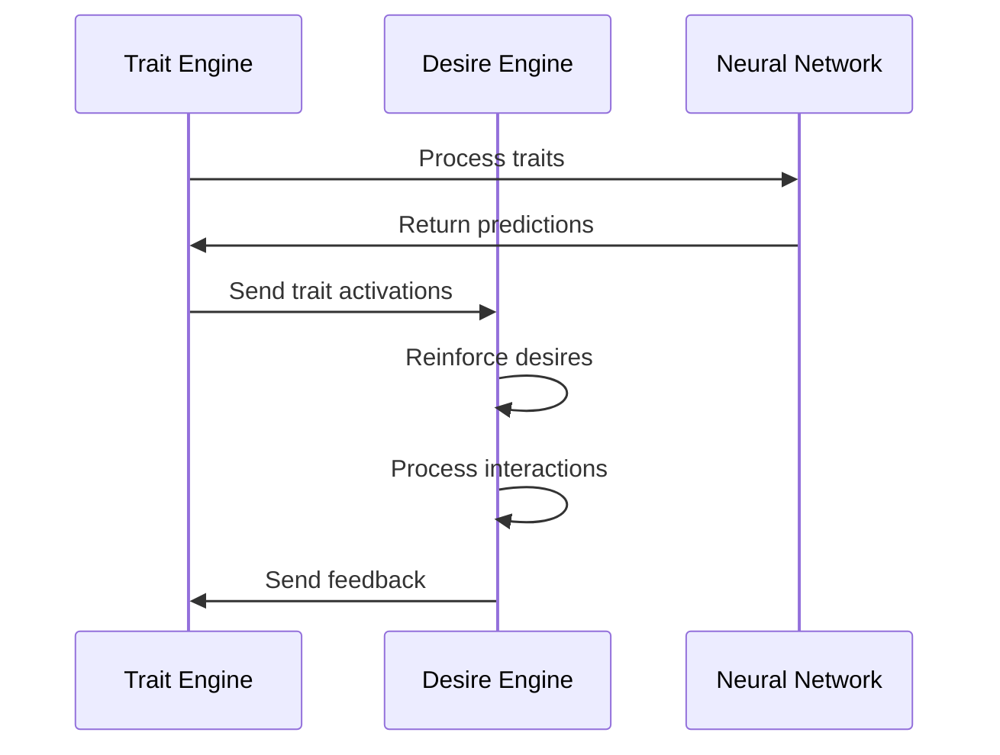
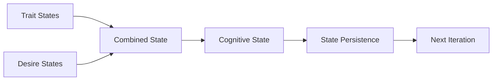

# Ilanya Data Flow Architecture

## System Data Flow Overview



## Detailed Data Flow

### 1. Input Data Processing

#### **Trait Data Input**


**Data Transformation:**
```python
# Input: Raw trait data
raw_traits = {
    "openness": 0.8,
    "creativity": 0.7,
    "adaptability": 0.6
}

# Output: TraitVector objects
trait_vectors = {
    TraitType.OPENNESS: TraitVector(TraitType.OPENNESS, 0.8, 0.9),
    TraitType.CREATIVITY: TraitVector(TraitType.CREATIVITY, 0.7, 0.8),
    TraitType.ADAPTABILITY: TraitVector(TraitType.ADAPTABILITY, 0.6, 0.7)
}
```

#### **Experience Data Processing**


### 2. Trait Engine Data Flow

#### **Neural Network Processing**


**Data Flow:**
```python
# Input tensors
trait_values = torch.tensor([[0.8, 0.7, 0.6]])
trait_confidences = torch.tensor([[0.9, 0.8, 0.7]])
trait_indices = torch.tensor([[0, 1, 2]])

# Neural network forward pass
outputs = trait_transformer(trait_values, trait_confidences, trait_indices)

# Output processing
trait_predictions = outputs['trait_predictions']  # Shape: [batch, num_traits, 2]
evolution_signals = outputs['evolution_signals']  # Shape: [batch, num_traits]
```

#### **State Management Flow**


### 3. Desire Engine Data Flow

#### **Desire Processing Pipeline**


#### **Interaction Network Processing**


**Data Structures:**
```python
# Interaction network
interaction_network = {
    'interactions': {
        ('desire_1', 'desire_2'): 0.85,
        ('desire_1', 'desire_3'): 0.72,
        ('desire_2', 'desire_3'): 0.91
    },
    'emergent_desires': [
        Desire(id="emergent_1", name="Emergent: Learning + Creativity", ...)
    ],
    'synergy_matrix': np.array([[1.0, 0.85, 0.72], ...])
}
```

### 4. Cross-Engine Data Exchange

#### **Trait to Desire Flow**


#### **State Synchronization**


### 5. Output Data Generation

#### **Prediction Output**
```python
# Trait predictions
trait_predictions = {
    TraitType.OPENNESS: TraitVector(TraitType.OPENNESS, 0.82, 0.88),
    TraitType.CREATIVITY: TraitVector(TraitType.CREATIVITY, 0.75, 0.85),
    TraitType.ADAPTABILITY: TraitVector(TraitType.ADAPTABILITY, 0.68, 0.79)
}

# Evolution signals
evolution_signals = {
    TraitType.OPENNESS: 0.02,      # Positive evolution
    TraitType.CREATIVITY: 0.05,    # Strong positive evolution
    TraitType.ADAPTABILITY: -0.01  # Slight negative evolution
}
```

#### **Goal Generation**
```python
# Goal candidates
goal_candidates = [
    {
        'desire_id': 'desire_1',
        'name': 'Desire for Learning',
        'strength': 0.95,
        'goal_potential': 0.85,
        'priority': 'high'
    },
    {
        'desire_id': 'emergent_1',
        'name': 'Emergent: Learning + Creativity',
        'strength': 0.88,
        'goal_potential': 0.72,
        'priority': 'medium'
    }
]
```

### 6. Logging and Monitoring

#### **Data Logging Flow**


#### **Metrics Collection**
```python
# System metrics
system_metrics = {
    'entropy': 2.833,
    'complexity': 0.896,
    'stability': 1.000,
    'average_strength': 0.992,
    'interaction_count': 66,
    'emergent_desires': 5,
    'goal_candidates': 0
}
```

## Data Persistence

### 1. State Persistence


### 2. Configuration Persistence
```yaml
# Configuration file structure
trait_engine:
  embedding_dim: 64
  num_layers: 2
  learning_rate: 1e-4

desire_engine:
  interaction_threshold: 0.05
  emergent_threshold: 0.3
  decay_rate: 0.01
```

## Data Validation

### 1. Input Validation
```python
# Trait value validation
def validate_trait_value(value: float) -> bool:
    return 0.0 <= value <= 1.0

# Confidence validation
def validate_confidence(confidence: float) -> bool:
    return 0.0 <= confidence <= 1.0
```

### 2. State Validation
```python
# State consistency check
def validate_state_consistency(state: CognitiveState) -> bool:
    # Check trait state consistency
    # Validate cognitive metrics
    # Ensure temporal coherence
    return True
```

## Performance Considerations

### 1. Data Flow Optimization
- **Batch Processing**: Process multiple traits/desires together
- **Caching**: Cache frequently accessed data
- **Lazy Loading**: Load data only when needed

### 2. Memory Management
- **Tensor Reuse**: Reuse tensors where possible
- **Garbage Collection**: Proper cleanup of temporary objects
- **Memory Pooling**: Pool allocation for similar objects

## Error Handling

### 1. Data Flow Error Recovery
```python
try:
    # Process data flow
    result = process_data_flow(input_data)
except ValidationError as e:
    # Handle validation errors
    logger.error(f"Validation failed: {e}")
    return fallback_result
except ProcessingError as e:
    # Handle processing errors
    logger.error(f"Processing failed: {e}")
    return cached_result
```

### 2. State Recovery
```python
def recover_state():
    # Load last known good state
    # Validate state integrity
    # Repair if necessary
    # Continue processing
```

## Key Benefits

### 🔄 **Seamless Integration**
- Smooth data flow between engines
- Consistent data formats
- Real-time state synchronization

### 📊 **Comprehensive Monitoring**
- Full data flow tracking
- Performance metrics collection
- Error detection and recovery

### 🎯 **Predictable Behavior**
- Validated data at each step
- Consistent processing pipeline
- Reproducible results

### 🚀 **Scalable Architecture**
- Modular data processing
- Efficient memory usage
- Optimized performance 