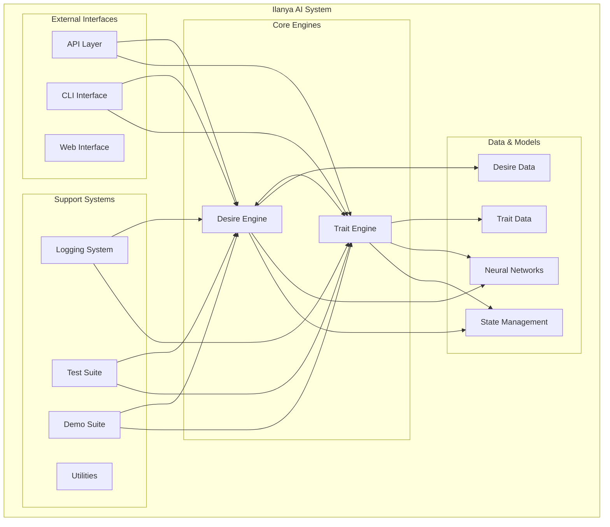

# Ilanya - Overall System Architecture

## System Overview



## Component Relationships

### 1. Core Engines
- **Desire Engine**: Processes and manages desires, interactions, and emergent behaviors
- **Trait Engine**: Handles personality traits, cognitive states, and trait evolution

### 2. Data Flow
- **Trait Data**: Personality vectors, matrices, and state tracking
- **Desire Data**: Desire objects, interaction networks, and emergent desires
- **Neural Networks**: Transformer-based models for processing traits and desires
- **State Management**: Persistent state storage and retrieval

### 3. Support Infrastructure
- **Logging System**: Structured logging with organized directories
- **Test Suite**: Comprehensive testing with pytest and unittest
- **Demo Suite**: Interactive demonstrations of system capabilities
- **Utilities**: Common utilities and helper functions

### 4. External Interfaces
- **API Layer**: RESTful API for external integration
- **CLI Interface**: Command-line tools for system management
- **Web Interface**: Web-based dashboard and controls

## Directory Structure

```
Ilanya/
├── IlanyaDesireEngine/     # Desire processing engine
├── IlanyaTraitEngine/      # Trait processing engine
├── Tests/                  # Test suite and runner
├── Demo/                   # Demo applications
├── Logs/                   # Structured log files
├── utils/                  # Common utilities
├── Diagrams/               # Architecture documentation
├── Docs/                   # System documentation
└── Assets/                 # Static assets
```

## Key Features

### 🔄 **Modular Architecture**
- Independent engines that can operate separately or together
- Plugin-based module system for extensibility
- Clear separation of concerns

### 🧠 **Neural Network Integration**
- Transformer-based models for complex pattern recognition
- Embedding layers for trait and desire representation
- Attention mechanisms for interaction modeling

### 📊 **Comprehensive Logging**
- Structured logging with organized directories
- Persistent log files that accumulate over time
- Detailed test and demo execution tracking

### 🧪 **Robust Testing**
- Unit tests for all components
- Integration tests for engine interactions
- Automated test runner with detailed reporting

### 🎯 **Emergent Behavior**
- Desire interaction networks
- Trait evolution and adaptation
- Cognitive state management 