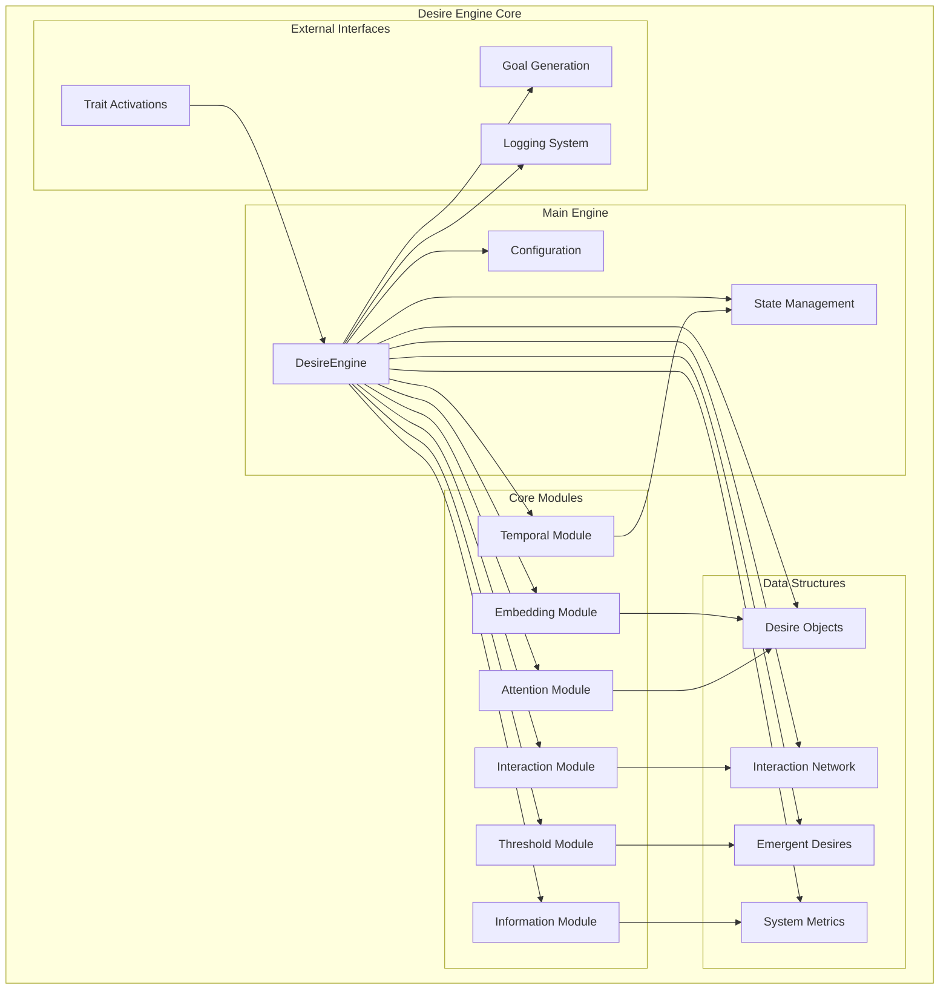
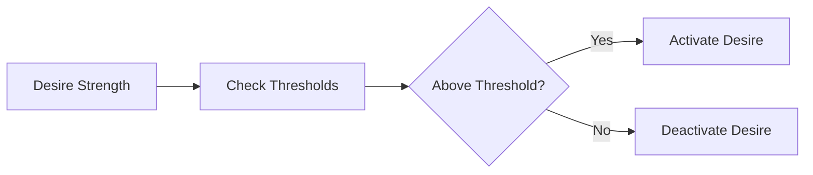
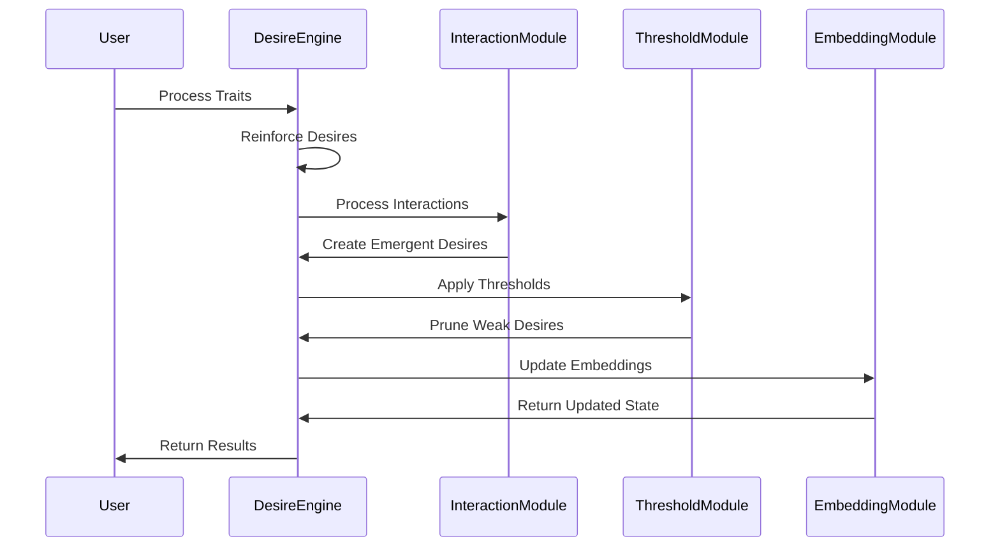

# Ilanya Desire Engine - Architecture

## Engine Overview



## Module Details

### 1. Core Engine Components

#### **DesireEngine (Main Controller)**
```python
class DesireEngine:
    - desires: Dict[str, Desire]
    - interaction_module: InteractionModule
    - threshold_module: ThresholdModule
    - embedding_module: EmbeddingModule
    - attention_module: AttentionModule
    - information_module: InformationModule
    - temporal_module: TemporalModule
```

#### **Configuration Management**
```python
class DesireEngineConfig:
    - interaction_threshold: float
    - synergy_threshold: float
    - emergent_threshold: float
    - conflict_threshold: float
    - decay_rate: float
    - reinforcement_rate: float
```

### 2. Processing Modules

#### **Interaction Module**


**Key Functions:**
- `process_interactions()`: Process all desire pairs
- `_calculate_interaction_strength()`: Compute synergy/conflict
- `_create_emergent_desire()`: Generate new emergent desires

#### **Threshold Module**


**Key Functions:**
- `apply_thresholds()`: Filter desires by strength
- `prune_weak_desires()`: Remove low-strength desires
- `reinforce_strong_desires()`: Boost high-strength desires

#### **Embedding Module**


**Key Functions:**
- `create_embeddings()`: Generate vector representations
- `compute_similarities()`: Calculate desire similarities
- `update_embeddings()`: Refresh embeddings

### 3. Data Structures

#### **Desire Object**
```python
@dataclass
class Desire:
    id: str
    name: str
    source_traits: List[str]
    strength: float
    base_strength: float
    reinforcement_count: int
    last_reinforcement: datetime
    emergent: bool = False
    parent_desires: List[str] = None
```

#### **Interaction Network**
```python
class InteractionNetwork:
    - interactions: Dict[Tuple[str, str], float]
    - emergent_desires: List[Desire]
    - synergy_matrix: np.ndarray
    - conflict_matrix: np.ndarray
```

### 4. Processing Pipeline



## Key Features

### 🎯 **Emergent Desire Creation**
- Automatic generation of new desires from interactions
- Synergy-based emergent behavior
- Hierarchical desire relationships

### 🔄 **Dynamic Processing**
- Real-time desire strength updates
- Adaptive threshold management
- Continuous interaction processing

### 📊 **Comprehensive Metrics**
- Entropy calculations
- Complexity measurements
- Stability tracking
- Network analysis

### 🧠 **Neural Integration**
- Embedding-based desire representation
- Attention mechanisms for focus
- Temporal processing for evolution

## File Structure

```
IlanyaDesireEngine/
├── desire_engine/
│   ├── __init__.py
│   ├── core.py              # Main engine
│   ├── config.py            # Configuration
│   ├── models.py            # Data models
│   └── modules/
│       ├── __init__.py
│       ├── attention.py     # Attention mechanisms
│       ├── embedding.py     # Embedding generation
│       ├── information.py   # Information processing
│       ├── interaction.py   # Interaction handling
│       ├── temporal.py      # Temporal processing
│       └── threshold.py     # Threshold management
├── requirements.txt
└── README.md
```

## Configuration Options

| Parameter | Default | Description |
|-----------|---------|-------------|
| `interaction_threshold` | 0.05 | Minimum interaction strength |
| `synergy_threshold` | 0.2 | Synergy detection threshold |
| `emergent_threshold` | 0.3 | Emergent desire creation threshold |
| `conflict_threshold` | 0.1 | Conflict detection threshold |
| `decay_rate` | 0.01 | Desire strength decay rate |
| `reinforcement_rate` | 0.1 | Reinforcement learning rate | 