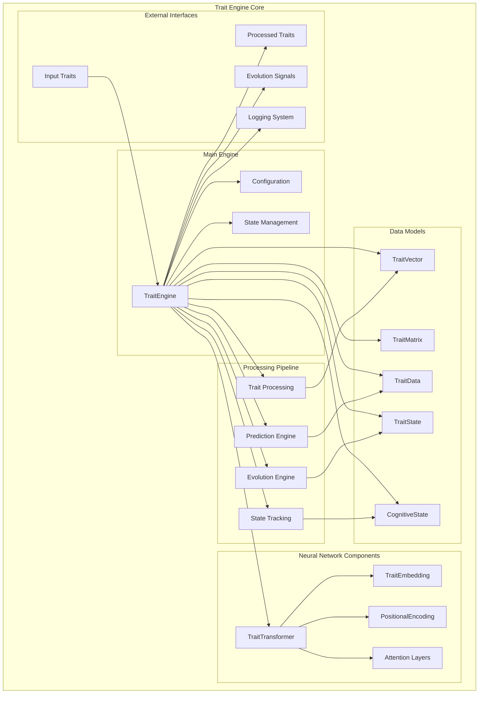
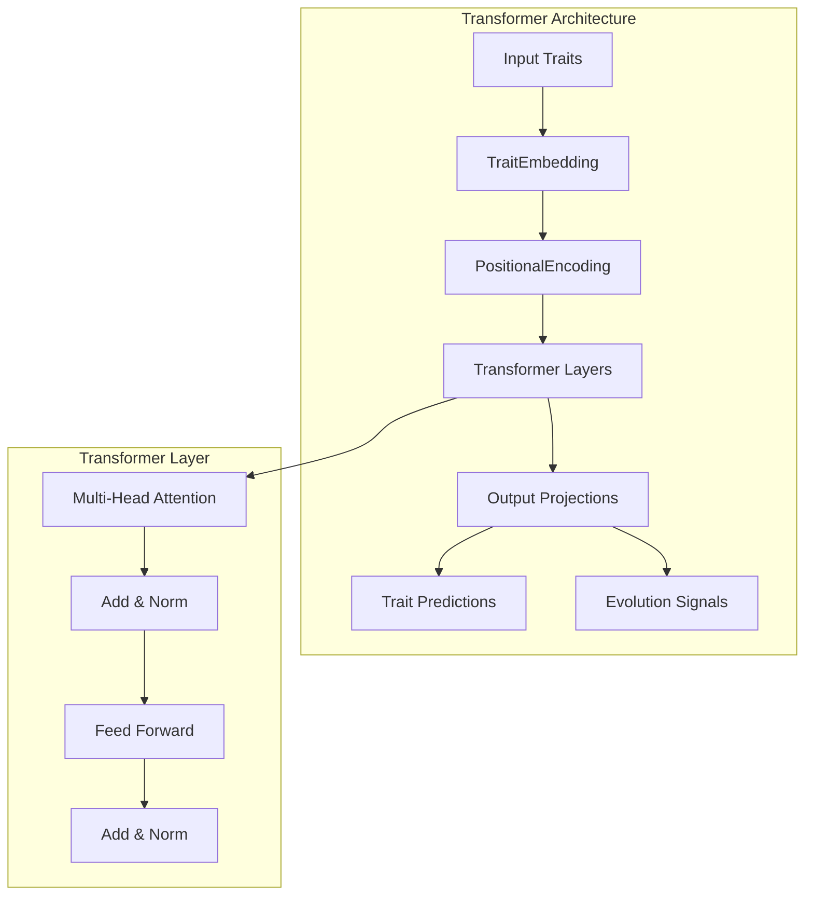
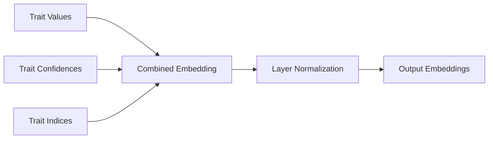
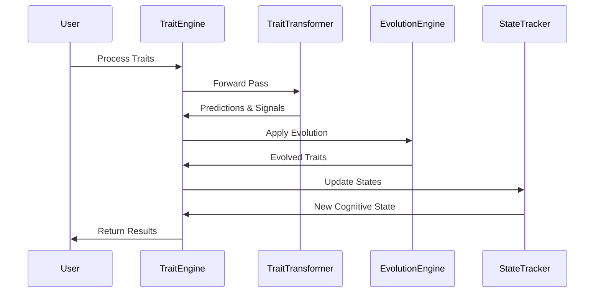
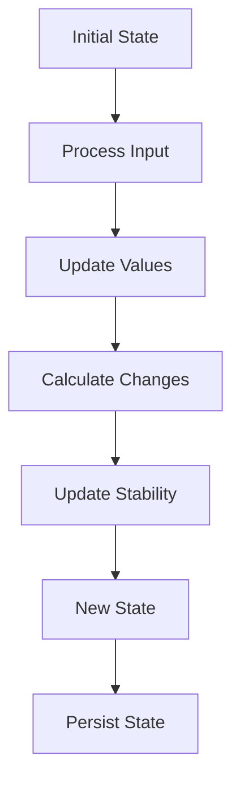

# Ilanya Trait Engine - Architecture

## Engine Overview



## Component Details

### 1. Core Engine Components

#### **TraitEngine (Main Controller)**
```python
class TraitEngine:
    - neural_network: TraitTransformer
    - trait_states: Dict[TraitType, TraitState]
    - cognitive_state: CognitiveState
    - config: TraitEngineConfig
    - device: torch.device
```

#### **Configuration Management**
```python
class TraitEngineConfig:
    - embedding_dim: int
    - num_layers: int
    - num_heads: int
    - dropout: float
    - learning_rate: float
    - evolution_rate: float
```

### 2. Neural Network Architecture

#### **TraitTransformer**


**Key Components:**
- **TraitEmbedding**: Converts trait data to vector representations
- **PositionalEncoding**: Adds positional information to embeddings
- **Multi-Head Attention**: Processes trait relationships
- **Feed Forward Networks**: Non-linear transformations

#### **Embedding Process**


### 3. Data Structures

#### **TraitVector**
```python
@dataclass
class TraitVector:
    trait_type: TraitType
    value: float          # 0.0 to 1.0
    confidence: float     # 0.0 to 1.0
    
    def __post_init__(self):
        # Validation logic
        if not 0.0 <= self.value <= 1.0:
            raise ValueError("Trait value must be between 0 and 1")
```

#### **TraitMatrix**
```python
class TraitMatrix:
    traits: Dict[TraitType, TraitVector]
    interaction_matrix: np.ndarray
    metadata: Dict[str, Any]
```

#### **TraitState**
```python
@dataclass
class TraitState:
    trait_type: TraitType
    current_value: float
    previous_value: Optional[float]
    confidence: float
    change_rate: Optional[float]
    stability_score: float
```

#### **CognitiveState**
```python
@dataclass
class CognitiveState:
    trait_states: Dict[TraitType, TraitState]
    timestamp: datetime
    overall_stability: float
    cognitive_load: float
    attention_focus: float
    emotional_state: float
    processing_speed: float
    memory_availability: float
    decision_confidence: float
```

### 4. Processing Pipeline



### 5. Evolution Engine

#### **Trait Evolution Process**


**Evolution Factors:**
- **Experience**: External stimuli and events
- **Learning**: Knowledge acquisition and skill development
- **Stress**: Environmental pressure and challenges
- **Success**: Achievement and positive reinforcement

### 6. State Management

#### **State Tracking**


## Key Features

### 🧠 **Neural Network Processing**
- Transformer-based architecture for complex trait relationships
- Multi-head attention for trait interaction modeling
- Embedding-based representation learning

### 🔄 **Dynamic Evolution**
- Real-time trait evolution based on experience
- Adaptive learning rates and evolution signals
- Bounded evolution within valid ranges

### 📊 **Comprehensive State Tracking**
- Detailed trait state history
- Cognitive state monitoring
- Stability and change rate calculations

### 🎯 **Prediction Capabilities**
- Trait value predictions
- Confidence estimation
- Evolution signal generation

## File Structure

```
IlanyaTraitEngine/
├── src/
│   ├── __init__.py
│   ├── trait_engine/
│   │   ├── __init__.py
│   │   └── trait_engine.py
│   ├── trait_models/
│   │   ├── __init__.py
│   │   ├── trait_data.py
│   │   ├── trait_state.py
│   │   └── trait_types.py
│   ├── neural_networks/
│   │   ├── __init__.py
│   │   └── trait_transformer.py
│   └── utils/
├── configs/
│   └── default_config.yaml
├── models/
│   ├── ilanya_trait_model.pt
│   └── ilanya_trait_config.yaml
├── examples/
│   ├── basic_usage.py
│   ├── full_system_demo.py
│   └── train_and_save_model.py
└── requirements.txt
```

## Configuration Options

| Parameter | Default | Description |
|-----------|---------|-------------|
| `embedding_dim` | 64 | Embedding dimension |
| `num_layers` | 2 | Number of transformer layers |
| `num_heads` | 4 | Number of attention heads |
| `dropout` | 0.1 | Dropout rate |
| `learning_rate` | 1e-4 | Learning rate for training |
| `evolution_rate` | 0.01 | Trait evolution rate |

## Trait Types

### **Core Personality Traits**
- **OPENNESS**: Openness to experience
- **CONSCIENTIOUSNESS**: Conscientiousness
- **EXTRAVERSION**: Extraversion
- **AGREEABLENESS**: Agreeableness
- **NEUROTICISM**: Neuroticism

### **Cognitive Traits**
- **CREATIVITY**: Creative thinking
- **ADAPTABILITY**: Adaptability to change
- **LEARNING_RATE**: Learning speed
- **MEMORY**: Memory capacity
- **ATTENTION**: Attention span

### **Behavioral Traits**
- **SOCIAL_SKILLS**: Social interaction ability
- **LEADERSHIP**: Leadership qualities
- **EMPATHY**: Empathetic understanding
- **RESILIENCE**: Stress resilience
- **CURIOSITY**: Curiosity and exploration 