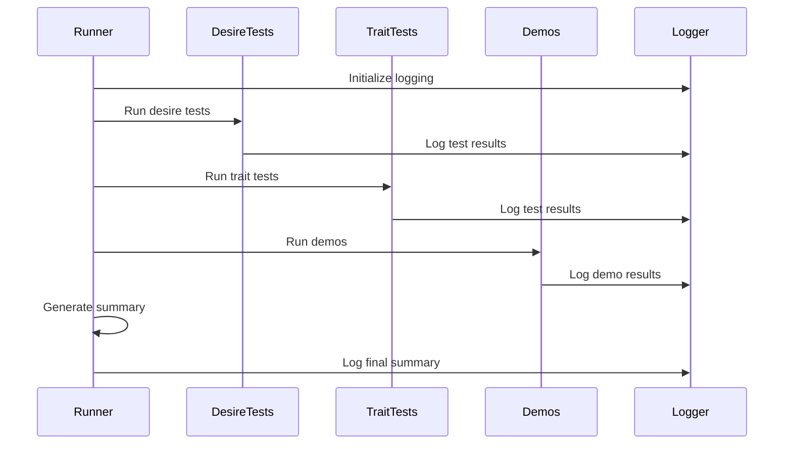
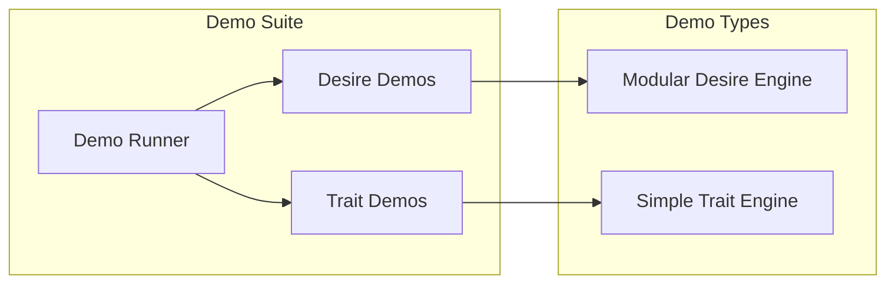
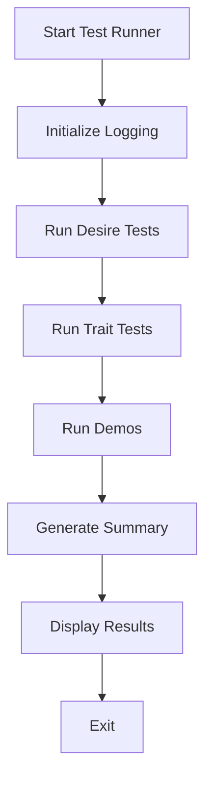
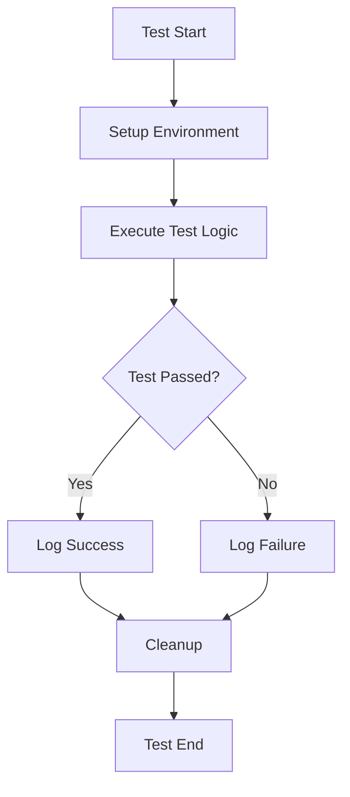

# Ilanya Test Suite - Architecture

## System Overview

```mermaid
graph TB
    subgraph "Test Suite Core"
        subgraph "Test Runner"
            TR[run_tests.py]
            TR2[Test Runner]
            SUMMARY[Summary Reporter]
        end
        
        subgraph "Test Categories"
            DE_TESTS[Desire Engine Tests]
            TE_TESTS[Trait Engine Tests]
            INT_TESTS[Integration Tests]
        end
        
        subgraph "Demo Suite"
            DE_DEMOS[Desire Engine Demos]
            TE_DEMOS[Trait Engine Demos]
            DEMO_RUNNER[Demo Runner]
        end
        
        subgraph "Testing Framework"
            PYTEST[pytest]
            UNITTEST[unittest]
            LOGGING[Logging Integration]
        end
    end
    
    subgraph "Test Components"
        subgraph "Desire Tests"
            ED[Emergent Desires]
            IN[Interaction Networks]
            TH[Threshold Management]
            EM[Embedding Tests]
        end
        
        subgraph "Trait Tests"
            TT[Trait Types]
            TD[Trait Data]
            TS[Trait State]
            NN[Neural Networks]
        end
    end
    
    subgraph "External Systems"
        DE[Desire Engine]
        TE[Trait Engine]
        LOGS[Logging System]
    end
    
    %% Test Runner connections
    TR --> TR2
    TR2 --> SUMMARY
    TR2 --> DE_TESTS
    TR2 --> TE_TESTS
    TR2 --> INT_TESTS
    TR2 --> DE_DEMOS
    TR2 --> TE_DEMOS
    
    %% Test Framework connections
    DE_TESTS --> PYTEST
    TE_TESTS --> PYTEST
    INT_TESTS --> UNITTEST
    DE_DEMOS --> UNITTEST
    TE_DEMOS --> UNITTEST
    
    %% Test Components
    DE_TESTS --> ED
    DE_TESTS --> IN
    DE_TESTS --> TH
    DE_TESTS --> EM
    
    TE_TESTS --> TT
    TE_TESTS --> TD
    TE_TESTS --> TS
    TE_TESTS --> NN
    
    %% External connections
    DE_TESTS --> DE
    TE_TESTS --> TE
    DE_DEMOS --> DE
    TE_DEMOS --> TE
    DE_TESTS --> LOGS
    TE_TESTS --> LOGS
```



## Component Details

### 1. Test Runner Architecture

#### **Main Test Runner (run_tests.py)**
```python
class TestRunner:
    def run_desire_engine_tests() -> Tuple[bool, int, int, int]
    def run_trait_engine_tests() -> Tuple[bool, int, int, int]
    def run_demos() -> Tuple[bool, int, int, int]
    def generate_summary() -> str
```

**Key Features:**
- Orchestrates all test execution
- Provides detailed reporting
- Integrates with logging system
- Handles both pytest and unittest

#### **Test Execution Flow**


### 2. Test Categories

#### **Desire Engine Tests**
```python
class TestEmergentDesires(unittest.TestCase):
    def test_emergent_desire_creation()
    def test_emergent_desire_logging()
    def test_emergent_desire_persistence()
    def test_emergent_desire_threshold()
    def test_interaction_results_structure()

class TestInteractionModule(unittest.TestCase):
    def test_calculate_interaction_strength()
    def test_create_emergent_desire()
```

**Test Coverage:**
- Emergent desire creation and validation
- Interaction network processing
- Threshold management
- State persistence
- Logging verification

#### **Trait Engine Tests**
```python
class TestTraitTypes:
    def test_trait_type_enum()
    def test_trait_categories()
    def test_trait_dimensions()

class TestTraitData:
    def test_trait_vector_creation()
    def test_trait_vector_validation()
    def test_trait_matrix_creation()
    def test_trait_data_builder()

class TestTraitState:
    def test_trait_state_creation()
    def test_cognitive_state_creation()

class TestNeuralNetworkComponents:
    def test_trait_embedding()
    def test_positional_encoding()
```

**Test Coverage:**
- Trait type definitions and enums
- Data structure validation
- State management
- Neural network components

### 3. Demo Suite

#### **Demo Architecture**


#### **Demo Components**
```python
# Desire Engine Demo
def modular_desire_engine_demo():
    - Initialize desire engine
    - Create sample trait states
    - Process multiple iterations
    - Generate emergent desires
    - Compute embeddings and attention

# Trait Engine Demo
def simple_trait_engine_demo():
    - Initialize trait engine
    - Create sample traits
    - Process through neural network
    - Demonstrate evolution
    - Run multiple cycles
```

### 4. Testing Framework Integration

#### **pytest Integration**
```python
# For trait engine tests
import pytest

class TestTraitTypes:
    @classmethod
    def setup_class(cls):
        cls.logger = setup_logger(...)
    
    def test_trait_type_enum(self):
        assert TraitType.OPENNESS.value == "openness"
        # ... more assertions
```

#### **unittest Integration**
```python
# For desire engine tests
import unittest

class TestEmergentDesires(unittest.TestCase):
    def setUp(self):
        self.config = DesireEngineConfig(...)
        self.desire_engine = DesireEngine(self.config)
    
    def test_emergent_desire_creation(self):
        # ... test implementation
        self.assertEqual(emergent_count, 1)
```

### 5. Logging Integration

#### **Test Logging Pattern**
```python
def test_example():
    start_time = time.time()
    log_test_start(logger, "test_name", "Test description")
    
    try:
        # Test implementation
        assert result == expected
        log_test_end(logger, "test_name", True, duration)
    except Exception as e:
        log_test_end(logger, "test_name", False, duration)
        raise
```

#### **Demo Logging Pattern**
```python
def demo_example():
    start_time = time.time()
    log_demo_start(logger, "demo_name", "Demo description")
    
    try:
        # Demo implementation
        log_demo_end(logger, "demo_name", duration)
    except Exception as e:
        logger.error(f"Demo failed: {str(e)}")
        log_demo_end(logger, "demo_name", duration)
        raise
```

## File Structure

```
Tests/
├── run_tests.py                    # Main test runner
├── test_emergent_desires.py        # Desire engine tests
├── test_trait_engine.py            # Trait engine tests
└── Logs/                           # Test-specific logs
    ├── desire/
    │   └── tests/
    └── trait/
        └── tests/
```

## Test Execution Flow

### 1. Test Runner Process


### 2. Individual Test Process


## Configuration Options

### **Test Configuration**
```python
# Test runner configuration
TEST_CONFIG = {
    'desire_tests': True,
    'trait_tests': True,
    'demos': True,
    'verbose': True,
    'stop_on_failure': False
}
```

### **Framework Selection**
| Test Type | Framework | Reason |
|-----------|-----------|--------|
| Trait Tests | pytest | Better floating-point handling |
| Desire Tests | unittest | Legacy compatibility |
| Demos | unittest | Simple execution model |

## Key Features

### 🧪 **Comprehensive Coverage**
- Unit tests for all components
- Integration tests for engine interactions
- Demo validation for system behavior

### 📊 **Detailed Reporting**
- Test success/failure counts
- Execution duration tracking
- Detailed error reporting
- Summary generation

### 🔄 **Automated Execution**
- Single command test execution
- Automated demo running
- Continuous integration ready

### 📝 **Structured Logging**
- Test-specific log files
- Execution trace preservation
- Error context maintenance

## Test Results Example

```
🚀 Ilanya Test Runner
==================================================
Started at: 2025-06-29 16:55:15

🧪 Running Tests...
------------------------------
📊 Test Results:
  Desire Engine: 5 tests, 0 failures, 0 errors
  Trait Engine: 11 tests, 0 failures, 0 errors
  Total: 16 tests, 0 failures, 0 errors

🎬 Running Demos...
------------------------------
📊 Demo Results:
  Completed: 2/2 demos

🎯 Overall Summary:
  Tests: ✅ PASSED
  Demos: ✅ PASSED
  Overall: ✅ PASSED
  Duration: 10.11 seconds
```

## Benefits

### 🔍 **Quality Assurance**
- Automated validation of all components
- Regression testing capabilities
- Performance benchmarking

### 🛠️ **Development Support**
- Rapid feedback on changes
- Debugging assistance
- Documentation through tests

### 📈 **Monitoring**
- System health tracking
- Performance regression detection
- Feature validation

### 🚀 **Deployment Confidence**
- Pre-deployment validation
- Integration verification
- System behavior confirmation 