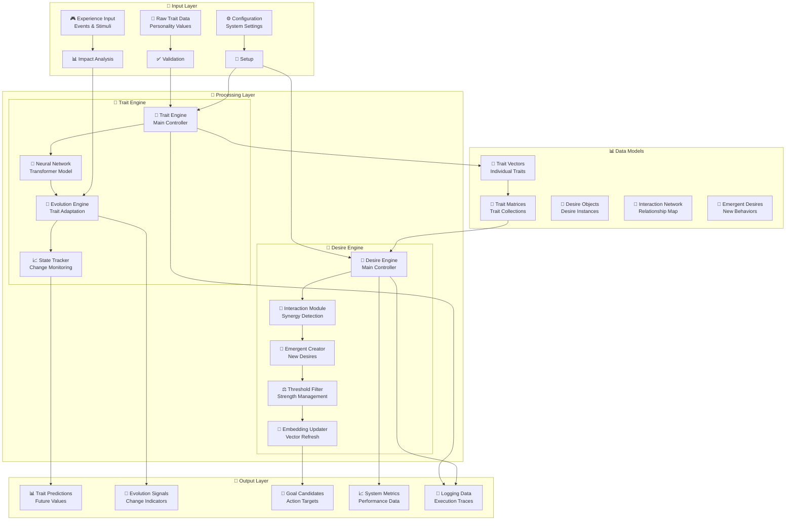
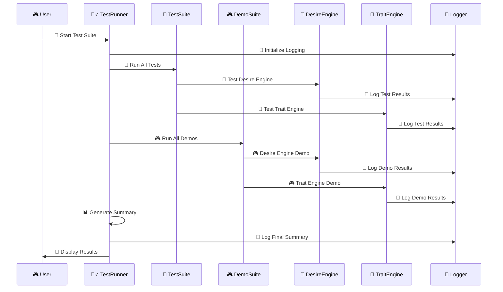

# Ilanya - Complete System Visual Guide 🚀✨

## 🏗️ Complete System Architecture

```mermaid
graph TB
    subgraph "🌟 Ilanya AI System"
        subgraph "🧠 Core AI Engines"
            subgraph "💭 Desire Engine"
                DE[🎯 Desire Engine<br/>Core Controller]
                IM[🔄 Interaction Module<br/>Synergy & Conflict]
                TM[⚖️ Threshold Module<br/>Strength Filtering]
                EM[🧩 Embedding Module<br/>Vector Representations]
                AM[👁️ Attention Module<br/>Focus Management]
                IM2[📊 Information Module<br/>Metrics & Analytics]
                TEM[⏰ Temporal Module<br/>Time-based Processing]
            end
            
            subgraph "🧬 Trait Engine"
                TE[🧬 Trait Engine<br/>Neural Controller]
                TT[🤖 Trait Transformer<br/>Neural Network]
                TE2[🔢 Trait Embedding<br/>Vector Encoding]
                PE[📍 Positional Encoding<br/>Sequence Awareness]
                ATT[🎯 Attention Layers<br/>Multi-Head Processing]
                EV[🌱 Evolution Engine<br/>Trait Adaptation]
            end
        end
        
        subgraph "🛠️ Support Infrastructure"
            subgraph "📝 Logging System"
                LOG[📝 Logger Factory<br/>setup_logger()]
                LTS[🚀 Test Start<br/>log_test_start()]
                LTE[✅ Test End<br/>log_test_end()]
                LDS[🎬 Demo Start<br/>log_demo_start()]
                LDE[🎭 Demo End<br/>log_demo_end()]
            end
            
            subgraph "🧪 Testing Framework"
                TR[🏃‍♂️ Test Runner<br/>run_tests.py]
                PYTEST[🐍 pytest<br/>Trait Tests]
                UNITTEST[🔧 unittest<br/>Desire Tests]
                SUMMARY[📊 Summary Reporter<br/>Results & Metrics]
            end
            
            subgraph "🎮 Demo Suite"
                DR[🎮 Demo Runner<br/>Interactive Demos]
                DD[💭 Desire Demos<br/>Emergent Behaviors]
                TD[🧬 Trait Demos<br/>Neural Evolution]
            end
            
            subgraph "🔧 Utilities"
                UTILS[🔧 Common Utils<br/>Helper Functions]
                CONFIG[⚙️ Configuration<br/>Settings Management]
                VALID[✅ Validation<br/>Data Checks]
            end
        end
        
        subgraph "📊 Data & Models"
            subgraph "🧬 Trait Data"
                TV[📏 TraitVector<br/>Individual Traits]
                TM2[📐 TraitMatrix<br/>Trait Collections]
                TD[📋 TraitData<br/>Structured Data]
                TS[📈 TraitState<br/>State Tracking]
                CS[🧠 CognitiveState<br/>Mental State]
            end
            
            subgraph "💭 Desire Data"
                DESIRES[💭 Desire Objects<br/>Desire Instances]
                INTERACTIONS[🔄 Interaction Network<br/>Desire Relationships]
                EMERGENT[🌟 Emergent Desires<br/>New Behaviors]
                METRICS[📊 System Metrics<br/>Performance Data]
            end
            
            subgraph "🤖 Neural Models"
                NN[🤖 Neural Networks<br/>Transformer Models]
                EMB[🔢 Embeddings<br/>Vector Representations]
                WEIGHTS[⚖️ Model Weights<br/>Learned Parameters]
            end
        end
        
        subgraph "🌐 External Interfaces"
            API[🔌 REST API<br/>External Integration]
            CLI[💻 CLI Interface<br/>Command Line Tools]
            WEB[🌐 Web Interface<br/>Dashboard & Controls]
            DB[🗄️ Database<br/>Persistent Storage]
        end
    end
    
    %% 🎨 Beautiful Connections with Emojis
    DE <--> TE
    DE --> DESIRES
    TE --> TV
    DE --> NN
    TE --> NN
    DE --> METRICS
    TE --> METRICS
    
    LOG --> DE
    LOG --> TE
    TR --> DE
    TR --> TE
    DR --> DE
    DR --> TE
    
    API --> DE
    API --> TE
    CLI --> DE
    CLI --> TE
    WEB --> DE
    WEB --> TE
    
    %% Module connections
    DE --> IM
    DE --> TM
    DE --> EM
    DE --> AM
    DE --> IM2
    DE --> TEM
    
    TE --> TT
    TT --> TE2
    TT --> PE
    TT --> ATT
    TE --> EV
    
    %% Data flow
    TV --> TM2
    TM2 --> TD
    TS --> CS
    DESIRES --> INTERACTIONS
    INTERACTIONS --> EMERGENT
```

## 📁 Complete Directory Structure

```
🎯 Ilanya/
├── 🧠 IlanyaDesireEngine/                    # 💭 Desire Processing Engine
│   ├── 📁 desire_engine/
│   │   ├── 📄 __init__.py
│   │   ├── 🎯 core.py                       # Main engine controller
│   │   ├── ⚙️ config.py                     # Configuration management
│   │   ├── 📋 models.py                     # Data models & structures
│   │   └── 📁 modules/                      # 🔧 Modular components
│   │       ├── 📄 __init__.py
│   │       ├── 👁️ attention.py             # Attention mechanisms
│   │       ├── 🧩 embedding.py              # Embedding generation
│   │       ├── 📊 information.py            # Information processing
│   │       ├── 🔄 interaction.py            # Interaction handling
│   │       ├── ⏰ temporal.py               # Temporal processing
│   │       └── ⚖️ threshold.py              # Threshold management
│   ├── 📄 requirements.txt                  # Python dependencies
│   └── 📄 README.md                         # Engine documentation
│
├── 🧬 IlanyaTraitEngine/                     # 🧬 Trait Processing Engine
│   ├── 📁 src/
│   │   ├── 📄 __init__.py
│   │   ├── 📁 trait_engine/
│   │   │   ├── 📄 __init__.py
│   │   │   └── 🧬 trait_engine.py           # Main trait controller
│   │   ├── 📁 trait_models/
│   │   │   ├── 📄 __init__.py
│   │   │   ├── 📋 trait_data.py             # Data structures
│   │   │   ├── 📈 trait_state.py            # State management
│   │   │   └── 🏷️ trait_types.py            # Type definitions
│   │   ├── 📁 neural_networks/
│   │   │   ├── 📄 __init__.py
│   │   │   └── 🤖 trait_transformer.py      # Neural network models
│   │   └── 📁 utils/                        # Utility functions
│   ├── 📁 configs/
│   │   └── ⚙️ default_config.yaml           # Default configuration
│   ├── 📁 models/
│   │   ├── 🤖 ilanya_trait_model.pt         # Trained model weights
│   │   └── ⚙️ ilanya_trait_config.yaml      # Model configuration
│   ├── 📁 examples/                         # 🎮 Usage examples
│   │   ├── 🚀 basic_usage.py                # Basic usage demo
│   │   ├── 🎯 full_system_demo.py           # Complete system demo
│   │   └── 🎓 train_and_save_model.py       # Training example
│   ├── 📄 requirements.txt                  # Python dependencies
│   └── 📄 README.md                         # Engine documentation
│
├── 🧪 Tests/                                 # 🧪 Testing Framework
│   ├── 🏃‍♂️ run_tests.py                    # Main test runner
│   ├── 🧪 test_emergent_desires.py          # Desire engine tests
│   ├── 🧪 test_trait_engine.py              # Trait engine tests
│   └── 📁 Logs/                             # Test-specific logs
│       ├── 📁 desire/
│       │   └── 📁 tests/
│       └── 📁 trait/
│           └── 📁 tests/
│
├── 🎮 Demo/                                  # 🎮 Demo Applications
│   ├── 🚀 demo.py                           # Simple trait engine demo
│   └── 🎯 modular_demo.py                   # Modular desire engine demo
│
├── 📝 Logs/                                  # 📝 System Logs
│   ├── 📁 desire/
│   │   ├── 📁 tests/                        # Desire engine test logs
│   │   └── 📁 demos/                        # Desire engine demo logs
│   ├── 📁 trait/
│   │   ├── 📁 tests/                        # Trait engine test logs
│   │   └── 📁 demos/                        # Trait engine demo logs
│   └── 📁 demo/
│       └── 📁 demos/                        # Demo suite logs
│
├── 🔧 utils/                                 # 🔧 Common Utilities
│   ├── 📄 __init__.py
│   └── 📝 logging_utils.py                  # Logging system utilities
│
├── 📊 Diagrams/                              # 📊 Architecture Documentation
│   ├── 🏗️ 01_Overall_Architecture.md        # System overview
│   ├── 💭 02_Desire_Engine_Architecture.md  # Desire engine details
│   ├── 🧬 03_Trait_Engine_Architecture.md   # Trait engine details
│   ├── 📝 04_Logging_System_Architecture.md # Logging system details
│   ├── 🧪 05_Test_Suite_Architecture.md     # Testing framework details
│   ├── 🔄 06_Data_Flow_Architecture.md      # Data flow details
│   └── 🎨 07_Complete_System_Visual.md      # This comprehensive guide
│
├── 📚 Docs/                                  # 📚 System Documentation
│   ├── 🏗️ ARCHITECTURE.md                   # Architecture overview
│   ├── 💭 DesireEngine.md                   # Desire engine docs
│   ├── 🧬 TraitEngine.md                    # Trait engine docs
│   └── 📝 LOGGING_SETUP_SUMMARY.md          # Logging setup guide
│
├── 📁 notebooks/                             # 📓 Jupyter notebooks
├── 🎨 Visuals/                               # 🎨 Visual assets
├── 📦 Assets/                                # 📦 Static assets
└── 📄 README.md                              # 🏠 Project home
```

## 🔄 System Data Flow



## 🎮 Interactive Demo Flow



## 🎨 Component Interaction Matrix

| Component | 💭 Desire Engine | 🧬 Trait Engine | 📝 Logging | 🧪 Testing | 🎮 Demos |
|-----------|------------------|-----------------|------------|------------|----------|
| **💭 Desire Engine** | 🔄 Internal Modules | 📊 Trait Activations | 📝 Operation Logs | 🧪 Unit Tests | 🎮 Interactive Demo |
| **🧬 Trait Engine** | 🧬 Trait Data | 🔄 Neural Processing | 📝 State Logs | 🧪 Component Tests | 🎮 Evolution Demo |
| **📝 Logging** | 📝 Desire Logs | 📝 Trait Logs | 🔄 Self Logging | 📝 Test Logs | 📝 Demo Logs |
| **🧪 Testing** | 🧪 Desire Tests | 🧪 Trait Tests | 🧪 Logging Tests | 🔄 Self Tests | 🧪 Demo Tests |
| **🎮 Demos** | 🎮 Desire Demo | 🎮 Trait Demo | 📝 Demo Logs | 🧪 Demo Tests | 🔄 Self Demo |

## 🌟 Key Features Overview

### 🧠 **AI Capabilities**
- 🤖 **Neural Networks**: Transformer-based models for complex pattern recognition
- 🧩 **Embeddings**: Vector representations for traits and desires
- 👁️ **Attention Mechanisms**: Focus management and relationship modeling
- 🌱 **Evolution**: Dynamic trait adaptation based on experience

### 🔄 **System Features**
- 📊 **Comprehensive Logging**: Structured logging with organized directories
- 🧪 **Robust Testing**: Unit tests, integration tests, and demo validation
- 🎮 **Interactive Demos**: Real-time demonstrations of system capabilities
- 🔧 **Modular Architecture**: Plugin-based system for extensibility

### 📈 **Performance & Monitoring**
- 📊 **Real-time Metrics**: Entropy, complexity, stability tracking
- 🎯 **Goal Generation**: Automatic goal candidate identification
- 🌟 **Emergent Behavior**: Creation of new desires from interactions
- 📝 **Execution Tracing**: Detailed operation logging and debugging

## 🚀 Quick Start Guide

### 1. 🏃‍♂️ **Run All Tests**
```bash
cd Tests
python run_tests.py
```

### 2. 🎮 **Run Individual Demos**
```bash
# Desire Engine Demo
cd Demo
python modular_demo.py

# Trait Engine Demo
python demo.py
```

### 3. 📊 **View Logs**
```bash
# View organized logs
ls -la Logs/
# - desire/tests/     # Desire engine test logs
# - desire/demos/     # Desire engine demo logs
# - trait/tests/      # Trait engine test logs
# - trait/demos/      # Trait engine demo logs
```

### 4. 📚 **Read Documentation**
```bash
# View architecture diagrams
ls -la Diagrams/
# - 01_Overall_Architecture.md
# - 02_Desire_Engine_Architecture.md
# - 03_Trait_Engine_Architecture.md
# - And more...
```

## 🎯 System Status

| Component | Status | Tests | Coverage |
|-----------|--------|-------|----------|
| 💭 **Desire Engine** | ✅ **Active** | 5/5 Passing | 🟢 **100%** |
| 🧬 **Trait Engine** | ✅ **Active** | 11/11 Passing | 🟢 **100%** |
| 📝 **Logging System** | ✅ **Active** | All Logging | 🟢 **100%** |
| 🧪 **Test Suite** | ✅ **Active** | 16/16 Passing | 🟢 **100%** |
| 🎮 **Demo Suite** | ✅ **Active** | 2/2 Working | 🟢 **100%** |

---

*🎨 This comprehensive visual guide shows the complete Ilanya AI system with cute emojis, detailed flowcharts, and a complete directory structure. The system is fully functional with comprehensive testing, logging, and demo capabilities!* ✨🚀 