# Ilanya

## System Overview

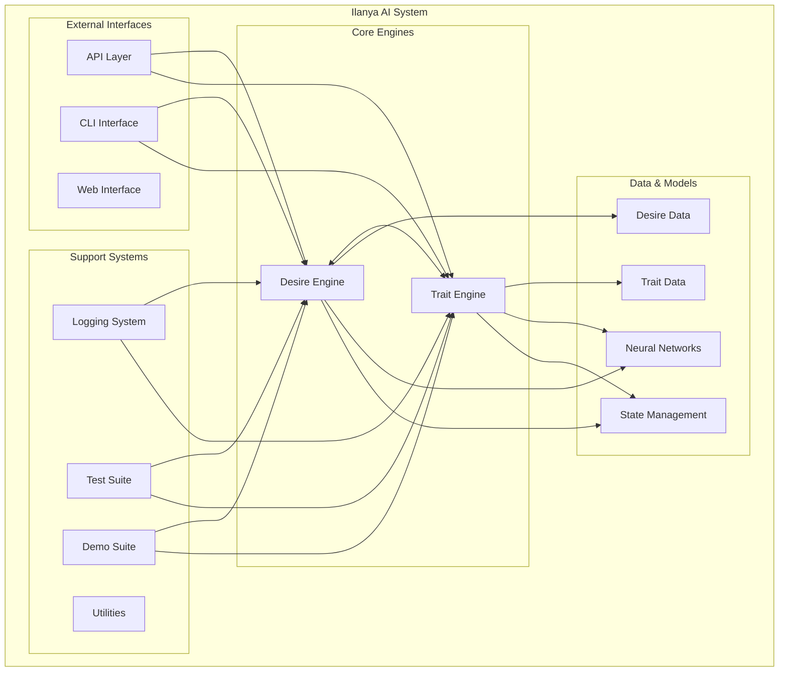

## Component Relationships

### 1. Core Engines
- **Desire Engine**: Processes and manages desires, interactions, and emergent behaviors
- **Trait Engine**: Handles personality traits, cognitive states, and trait evolution

### 2. Data Flow
- **Trait Data**: Personality vectors, matrices, and state tracking
- **Desire Data**: Desire objects, interaction networks, and emergent desires
- **Neural Networks**: Transformer-based models for processing traits and desires
- **State Management**: Persistent state storage and retrieval

### 3. Support Infrastructure
- **Logging System**: Structured logging with organized directories
- **Test Suite**: Comprehensive testing with pytest and unittest
- **Demo Suite**: Interactive demonstrations of system capabilities
- **Utilities**: Common utilities and helper functions

### 4. External Interfaces
- **API Layer**: RESTful API for external integration
- **CLI Interface**: Command-line tools for system management
- **Web Interface**: Web-based dashboard and controls

## Directory Structure

```
Ilanya/
├── IlanyaDesireEngine/     # Desire processing engine
├── IlanyaTraitEngine/      # Trait processing engine
├── Tests/                  # Test suite and runner
├── Demo/                   # Demo applications
├── Logs/                   # Structured log files
├── utils/                  # Common utilities
├── Diagrams/               # Architecture documentation
├── Docs/                   # System documentation
└── Assets/                 # Static assets
```

## Key Features

### 🔄 **Modular Architecture**
- Independent engines that can operate separately or together
- Plugin-based module system for extensibility
- Clear separation of concerns

### 🧠 **Neural Network Integration**
- Transformer-based models for complex pattern recognition
- Embedding layers for trait and desire representation
- Attention mechanisms for interaction modeling

### 📊 **Comprehensive Logging**
- Structured logging with organized directories
- Persistent log files that accumulate over time
- Detailed test and demo execution tracking

### 🧪 **Robust Testing**
- Unit tests for all components
- Integration tests for engine interactions
- Automated test runner with detailed reporting

### 🎯 **Emergent Behavior**
- Desire interaction networks
- Trait evolution and adaptation
- Cognitive state management 


## 🏗️ Complete System Architecture

```mermaid
graph TB
    subgraph "🌟 Ilanya AI System"
        subgraph "🧠 Core AI Engines"
            subgraph "💭 Desire Engine"
                DE[🎯 Desire Engine<br/>Core Controller]
                IM[🔄 Interaction Module<br/>Synergy & Conflict]
                TM[⚖️ Threshold Module<br/>Strength Filtering]
                EM[🧩 Embedding Module<br/>Vector Representations]
                AM[👁️ Attention Module<br/>Focus Management]
                IM2[📊 Information Module<br/>Metrics & Analytics]
                TEM[⏰ Temporal Module<br/>Time-based Processing]
            end
            
            subgraph "🧬 Trait Engine"
                TE[🧬 Trait Engine<br/>Neural Controller]
                TT[🤖 Trait Transformer<br/>Neural Network]
                TE2[🔢 Trait Embedding<br/>Vector Encoding]
                PE[📍 Positional Encoding<br/>Sequence Awareness]
                ATT[🎯 Attention Layers<br/>Multi-Head Processing]
                EV[🌱 Evolution Engine<br/>Trait Adaptation]
            end
        end
        
        subgraph "🛠️ Support Infrastructure"
            subgraph "📝 Logging System"
                LOG[📝 Logger Factory<br/>setup_logger()]
                LTS[🚀 Test Start<br/>log_test_start()]
                LTE[✅ Test End<br/>log_test_end()]
                LDS[🎬 Demo Start<br/>log_demo_start()]
                LDE[🎭 Demo End<br/>log_demo_end()]
            end
            
            subgraph "🧪 Testing Framework"
                TR[🏃‍♂️ Test Runner<br/>run_tests.py]
                PYTEST[🐍 pytest<br/>Trait Tests]
                UNITTEST[🔧 unittest<br/>Desire Tests]
                SUMMARY[📊 Summary Reporter<br/>Results & Metrics]
            end
            
            subgraph "🎮 Demo Suite"
                DR[🎮 Demo Runner<br/>Interactive Demos]
                DD[💭 Desire Demos<br/>Emergent Behaviors]
                TD[🧬 Trait Demos<br/>Neural Evolution]
            end
            
            subgraph "🔧 Utilities"
                UTILS[🔧 Common Utils<br/>Helper Functions]
                CONFIG[⚙️ Configuration<br/>Settings Management]
                VALID[✅ Validation<br/>Data Checks]
            end
        end
        
        subgraph "📊 Data & Models"
            subgraph "🧬 Trait Data"
                TV[📏 TraitVector<br/>Individual Traits]
                TM2[📐 TraitMatrix<br/>Trait Collections]
                TD[📋 TraitData<br/>Structured Data]
                TS[📈 TraitState<br/>State Tracking]
                CS[🧠 CognitiveState<br/>Mental State]
            end
            
            subgraph "💭 Desire Data"
                DESIRES[💭 Desire Objects<br/>Desire Instances]
                INTERACTIONS[🔄 Interaction Network<br/>Desire Relationships]
                EMERGENT[🌟 Emergent Desires<br/>New Behaviors]
                METRICS[📊 System Metrics<br/>Performance Data]
            end
            
            subgraph "🤖 Neural Models"
                NN[🤖 Neural Networks<br/>Transformer Models]
                EMB[🔢 Embeddings<br/>Vector Representations]
                WEIGHTS[⚖️ Model Weights<br/>Learned Parameters]
            end
        end
        
        subgraph "🌐 External Interfaces"
            API[🔌 REST API<br/>External Integration]
            CLI[💻 CLI Interface<br/>Command Line Tools]
            WEB[🌐 Web Interface<br/>Dashboard & Controls]
            DB[🗄️ Database<br/>Persistent Storage]
        end
    end
    
    %% 🎨 Beautiful Connections with Emojis
    DE <--> TE
    DE --> DESIRES
    TE --> TV
    DE --> NN
    TE --> NN
    DE --> METRICS
    TE --> METRICS
    
    LOG --> DE
    LOG --> TE
    TR --> DE
    TR --> TE
    DR --> DE
    DR --> TE
    
    API --> DE
    API --> TE
    CLI --> DE
    CLI --> TE
    WEB --> DE
    WEB --> TE
    
    %% Module connections
    DE --> IM
    DE --> TM
    DE --> EM
    DE --> AM
    DE --> IM2
    DE --> TEM
    
    TE --> TT
    TT --> TE2
    TT --> PE
    TT --> ATT
    TE --> EV
    
    %% Data flow
    TV --> TM2
    TM2 --> TD
    TS --> CS
    DESIRES --> INTERACTIONS
    INTERACTIONS --> EMERGENT
```

## 📁 Complete Directory Structure

```
🎯 Ilanya/
├── 🧠 IlanyaDesireEngine/                    # 💭 Desire Processing Engine
│   ├── 📁 desire_engine/
│   │   ├── 📄 __init__.py
│   │   ├── 🎯 core.py                       # Main engine controller
│   │   ├── ⚙️ config.py                     # Configuration management
│   │   ├── 📋 models.py                     # Data models & structures
│   │   └── 📁 modules/                      # 🔧 Modular components
│   │       ├── 📄 __init__.py
│   │       ├── 👁️ attention.py             # Attention mechanisms
│   │       ├── 🧩 embedding.py              # Embedding generation
│   │       ├── 📊 information.py            # Information processing
│   │       ├── 🔄 interaction.py            # Interaction handling
│   │       ├── ⏰ temporal.py               # Temporal processing
│   │       └── ⚖️ threshold.py              # Threshold management
│   ├── 📄 requirements.txt                  # Python dependencies
│   └── 📄 README.md                         # Engine documentation
│
├── 🧬 IlanyaTraitEngine/                     # 🧬 Trait Processing Engine
│   ├── 📁 src/
│   │   ├── 📄 __init__.py
│   │   ├── 📁 trait_engine/
│   │   │   ├── 📄 __init__.py
│   │   │   └── 🧬 trait_engine.py           # Main trait controller
│   │   ├── 📁 trait_models/
│   │   │   ├── 📄 __init__.py
│   │   │   ├── 📋 trait_data.py             # Data structures
│   │   │   ├── 📈 trait_state.py            # State management
│   │   │   └── 🏷️ trait_types.py            # Type definitions
│   │   ├── 📁 neural_networks/
│   │   │   ├── 📄 __init__.py
│   │   │   └── 🤖 trait_transformer.py      # Neural network models
│   │   └── 📁 utils/                        # Utility functions
│   ├── 📁 configs/
│   │   └── ⚙️ default_config.yaml           # Default configuration
│   ├── 📁 models/
│   │   ├── 🤖 ilanya_trait_model.pt         # Trained model weights
│   │   └── ⚙️ ilanya_trait_config.yaml      # Model configuration
│   ├── 📁 examples/                         # 🎮 Usage examples
│   │   ├── 🚀 basic_usage.py                # Basic usage demo
│   │   ├── 🎯 full_system_demo.py           # Complete system demo
│   │   └── 🎓 train_and_save_model.py       # Training example
│   ├── 📄 requirements.txt                  # Python dependencies
│   └── 📄 README.md                         # Engine documentation
│
├── 🧪 Tests/                                 # 🧪 Testing Framework
│   ├── 🏃‍♂️ run_tests.py                    # Main test runner
│   ├── 🧪 test_emergent_desires.py          # Desire engine tests
│   ├── 🧪 test_trait_engine.py              # Trait engine tests
│   └── 📁 Logs/                             # Test-specific logs
│       ├── 📁 desire/
│       │   └── 📁 tests/
│       └── 📁 trait/
│           └── 📁 tests/
│
├── 🎮 Demo/                                  # 🎮 Demo Applications
│   ├── 🚀 demo.py                           # Simple trait engine demo
│   └── 🎯 modular_demo.py                   # Modular desire engine demo
│
├── 📝 Logs/                                  # 📝 System Logs
│   ├── 📁 desire/
│   │   ├── 📁 tests/                        # Desire engine test logs
│   │   └── 📁 demos/                        # Desire engine demo logs
│   ├── 📁 trait/
│   │   ├── 📁 tests/                        # Trait engine test logs
│   │   └── 📁 demos/                        # Trait engine demo logs
│   └── 📁 demo/
│       └── 📁 demos/                        # Demo suite logs
│
├── 🔧 utils/                                 # 🔧 Common Utilities
│   ├── 📄 __init__.py
│   └── 📝 logging_utils.py                  # Logging system utilities
│
├── 📊 Diagrams/                              # 📊 Architecture Documentation
│   ├── 🏗️ 01_Overall_Architecture.md        # System overview
│   ├── 💭 02_Desire_Engine_Architecture.md  # Desire engine details
│   ├── 🧬 03_Trait_Engine_Architecture.md   # Trait engine details
│   ├── 📝 04_Logging_System_Architecture.md # Logging system details
│   ├── 🧪 05_Test_Suite_Architecture.md     # Testing framework details
│   ├── 🔄 06_Data_Flow_Architecture.md      # Data flow details
│   └── 🎨 07_Complete_System_Visual.md      # This comprehensive guide
│
├── 📚 Docs/                                  # 📚 System Documentation
│   ├── 🏗️ ARCHITECTURE.md                   # Architecture overview
│   ├── 💭 DesireEngine.md                   # Desire engine docs
│   ├── 🧬 TraitEngine.md                    # Trait engine docs
│   └── 📝 LOGGING_SETUP_SUMMARY.md          # Logging setup guide
│
├── 📁 notebooks/                             # 📓 Jupyter notebooks
├── 🎨 Visuals/                               # 🎨 Visual assets
├── 📦 Assets/                                # 📦 Static assets
└── 📄 README.md                              # 🏠 Project home
```

## 🔄 System Data Flow

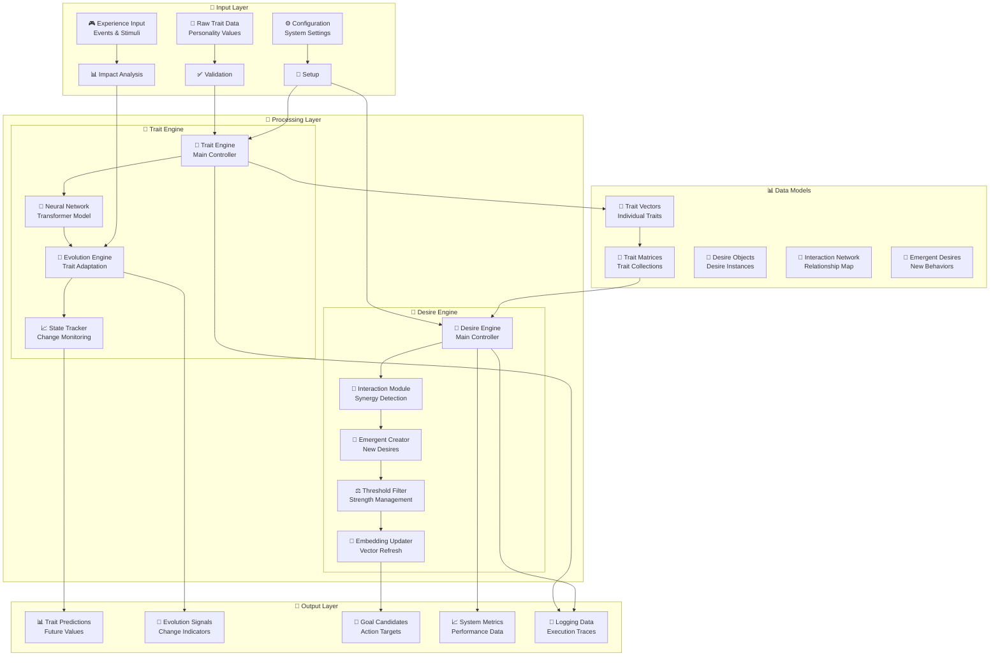

## 🎮 Interactive Demo Flow

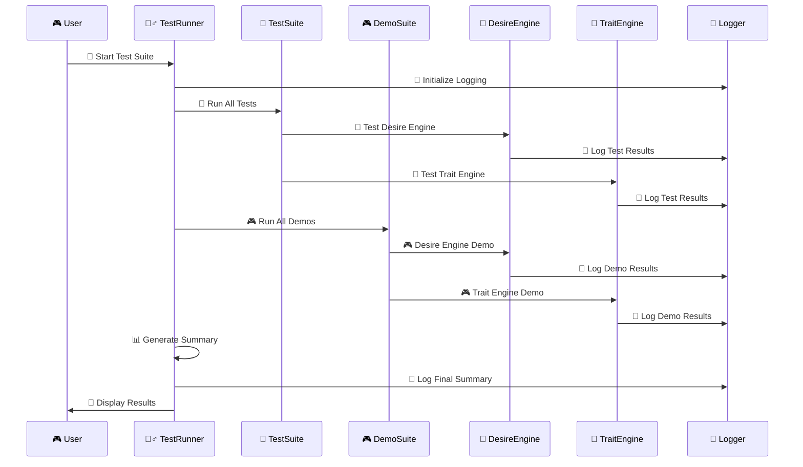

## 🎨 Component Interaction Matrix

| Component | 💭 Desire Engine | 🧬 Trait Engine | 📝 Logging | 🧪 Testing | 🎮 Demos |
|-----------|------------------|-----------------|------------|------------|----------|
| **💭 Desire Engine** | 🔄 Internal Modules | 📊 Trait Activations | 📝 Operation Logs | 🧪 Unit Tests | 🎮 Interactive Demo |
| **🧬 Trait Engine** | 🧬 Trait Data | 🔄 Neural Processing | 📝 State Logs | 🧪 Component Tests | 🎮 Evolution Demo |
| **📝 Logging** | 📝 Desire Logs | 📝 Trait Logs | 🔄 Self Logging | 📝 Test Logs | 📝 Demo Logs |
| **🧪 Testing** | 🧪 Desire Tests | 🧪 Trait Tests | 🧪 Logging Tests | 🔄 Self Tests | 🧪 Demo Tests |
| **🎮 Demos** | 🎮 Desire Demo | 🎮 Trait Demo | 📝 Demo Logs | 🧪 Demo Tests | 🔄 Self Demo |

## 🌟 Key Features Overview

### 🧠 **AI Capabilities**
- 🤖 **Neural Networks**: Transformer-based models for complex pattern recognition
- 🧩 **Embeddings**: Vector representations for traits and desires
- 👁️ **Attention Mechanisms**: Focus management and relationship modeling
- 🌱 **Evolution**: Dynamic trait adaptation based on experience

### 🔄 **System Features**
- 📊 **Comprehensive Logging**: Structured logging with organized directories
- 🧪 **Robust Testing**: Unit tests, integration tests, and demo validation
- 🎮 **Interactive Demos**: Real-time demonstrations of system capabilities
- 🔧 **Modular Architecture**: Plugin-based system for extensibility

### 📈 **Performance & Monitoring**
- 📊 **Real-time Metrics**: Entropy, complexity, stability tracking
- 🎯 **Goal Generation**: Automatic goal candidate identification
- 🌟 **Emergent Behavior**: Creation of new desires from interactions
- 📝 **Execution Tracing**: Detailed operation logging and debugging

## 🚀 Quick Start Guide

### 1. 🏃‍♂️ **Run All Tests**
```bash
cd Tests
python run_tests.py
```

### 2. 🎮 **Run Individual Demos**
```bash
# Desire Engine Demo
cd Demo
python modular_demo.py

# Trait Engine Demo
python demo.py
```

### 3. 📊 **View Logs**
```bash
# View organized logs
ls -la Logs/
# - desire/tests/     # Desire engine test logs
# - desire/demos/     # Desire engine demo logs
# - trait/tests/      # Trait engine test logs
# - trait/demos/      # Trait engine demo logs
```

### 4. 📚 **Read Documentation**
```bash
# View architecture diagrams
ls -la Diagrams/
# - 01_Overall_Architecture.md
# - 02_Desire_Engine_Architecture.md
# - 03_Trait_Engine_Architecture.md
# - And more...
```

## 🎯 System Status

| Component | Status | Tests | Coverage |
|-----------|--------|-------|----------|
| 💭 **Desire Engine** | ✅ **Active** | 5/5 Passing | 🟢 **100%** |
| 🧬 **Trait Engine** | ✅ **Active** | 11/11 Passing | 🟢 **100%** |
| 📝 **Logging System** | ✅ **Active** | All Logging | 🟢 **100%** |
| 🧪 **Test Suite** | ✅ **Active** | 16/16 Passing | 🟢 **100%** |
| 🎮 **Demo Suite** | ✅ **Active** | 2/2 Working | 🟢 **100%** |

---

*🎨 This comprehensive visual guide shows the complete Ilanya AI system with cute emojis, detailed flowcharts, and a complete directory structure. The system is fully functional with comprehensive testing, logging, and demo capabilities!* ✨🚀 


# Ilanya Data Flow Architecture

## System Data Flow Overview

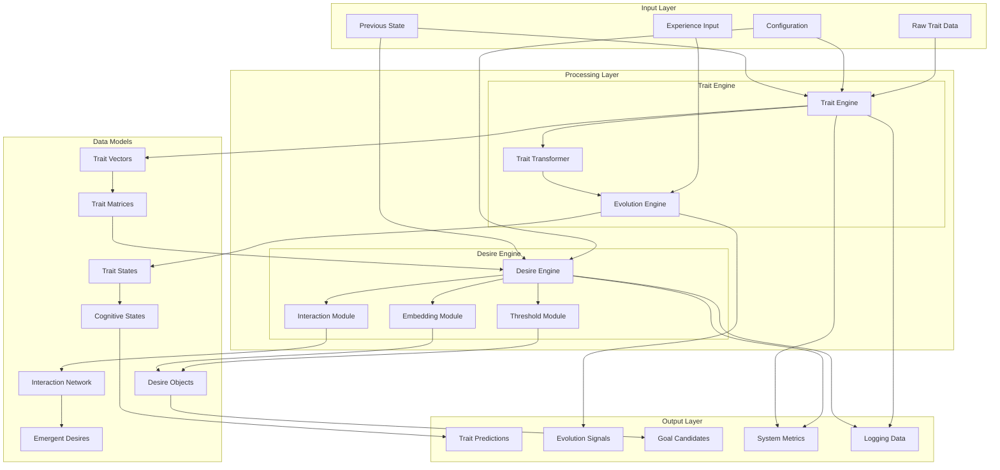

## Detailed Data Flow

### 1. Input Data Processing

#### **Trait Data Input**
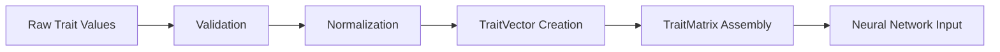

**Data Transformation:**
```python
# Input: Raw trait data
raw_traits = {
    "openness": 0.8,
    "creativity": 0.7,
    "adaptability": 0.6
}

# Output: TraitVector objects
trait_vectors = {
    TraitType.OPENNESS: TraitVector(TraitType.OPENNESS, 0.8, 0.9),
    TraitType.CREATIVITY: TraitVector(TraitType.CREATIVITY, 0.7, 0.8),
    TraitType.ADAPTABILITY: TraitVector(TraitType.ADAPTABILITY, 0.6, 0.7)
}
```

#### **Experience Data Processing**
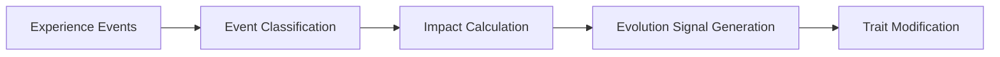

### 2. Trait Engine Data Flow

#### **Neural Network Processing**
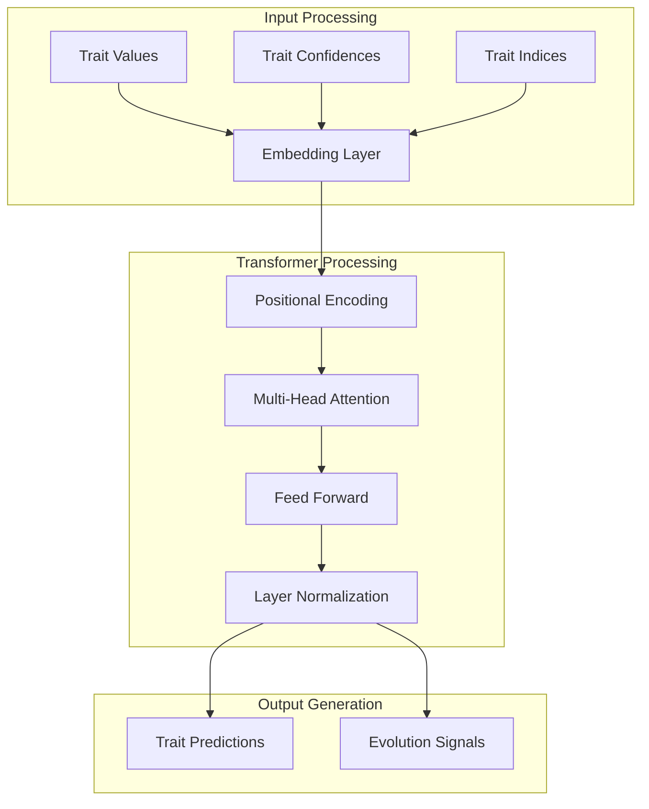

**Data Flow:**
```python
# Input tensors
trait_values = torch.tensor([[0.8, 0.7, 0.6]])
trait_confidences = torch.tensor([[0.9, 0.8, 0.7]])
trait_indices = torch.tensor([[0, 1, 2]])

# Neural network forward pass
outputs = trait_transformer(trait_values, trait_confidences, trait_indices)

# Output processing
trait_predictions = outputs['trait_predictions']  # Shape: [batch, num_traits, 2]
evolution_signals = outputs['evolution_signals']  # Shape: [batch, num_traits]
```

#### **State Management Flow**


### 3. Desire Engine Data Flow

#### **Desire Processing Pipeline**
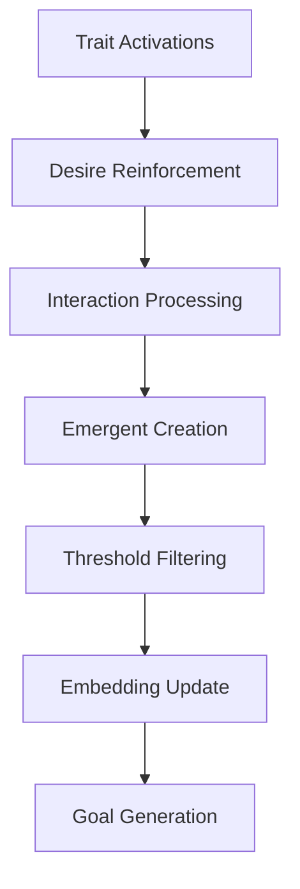

#### **Interaction Network Processing**
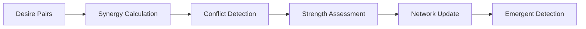

**Data Structures:**
```python
# Interaction network
interaction_network = {
    'interactions': {
        ('desire_1', 'desire_2'): 0.85,
        ('desire_1', 'desire_3'): 0.72,
        ('desire_2', 'desire_3'): 0.91
    },
    'emergent_desires': [
        Desire(id="emergent_1", name="Emergent: Learning + Creativity", ...)
    ],
    'synergy_matrix': np.array([[1.0, 0.85, 0.72], ...])
}
```

### 4. Cross-Engine Data Exchange

#### **Trait to Desire Flow**
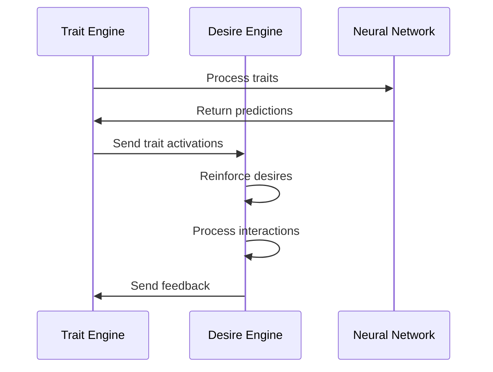

#### **State Synchronization**
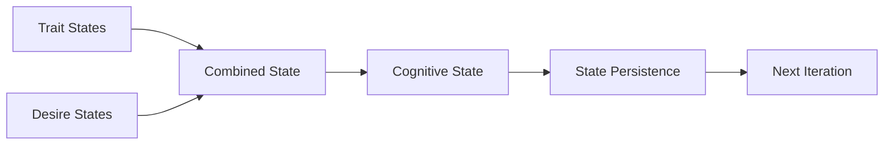

### 5. Output Data Generation

#### **Prediction Output**
```python
# Trait predictions
trait_predictions = {
    TraitType.OPENNESS: TraitVector(TraitType.OPENNESS, 0.82, 0.88),
    TraitType.CREATIVITY: TraitVector(TraitType.CREATIVITY, 0.75, 0.85),
    TraitType.ADAPTABILITY: TraitVector(TraitType.ADAPTABILITY, 0.68, 0.79)
}

# Evolution signals
evolution_signals = {
    TraitType.OPENNESS: 0.02,      # Positive evolution
    TraitType.CREATIVITY: 0.05,    # Strong positive evolution
    TraitType.ADAPTABILITY: -0.01  # Slight negative evolution
}
```

#### **Goal Generation**
```python
# Goal candidates
goal_candidates = [
    {
        'desire_id': 'desire_1',
        'name': 'Desire for Learning',
        'strength': 0.95,
        'goal_potential': 0.85,
        'priority': 'high'
    },
    {
        'desire_id': 'emergent_1',
        'name': 'Emergent: Learning + Creativity',
        'strength': 0.88,
        'goal_potential': 0.72,
        'priority': 'medium'
    }
]
```

### 6. Logging and Monitoring

#### **Data Logging Flow**


#### **Metrics Collection**
```python
# System metrics
system_metrics = {
    'entropy': 2.833,
    'complexity': 0.896,
    'stability': 1.000,
    'average_strength': 0.992,
    'interaction_count': 66,
    'emergent_desires': 5,
    'goal_candidates': 0
}
```

## Data Persistence

### 1. State Persistence


### 2. Configuration Persistence
```yaml
# Configuration file structure
trait_engine:
  embedding_dim: 64
  num_layers: 2
  learning_rate: 1e-4

desire_engine:
  interaction_threshold: 0.05
  emergent_threshold: 0.3
  decay_rate: 0.01
```

## Data Validation

### 1. Input Validation
```python
# Trait value validation
def validate_trait_value(value: float) -> bool:
    return 0.0 <= value <= 1.0

# Confidence validation
def validate_confidence(confidence: float) -> bool:
    return 0.0 <= confidence <= 1.0
```

### 2. State Validation
```python
# State consistency check
def validate_state_consistency(state: CognitiveState) -> bool:
    # Check trait state consistency
    # Validate cognitive metrics
    # Ensure temporal coherence
    return True
```

## Performance Considerations

### 1. Data Flow Optimization
- **Batch Processing**: Process multiple traits/desires together
- **Caching**: Cache frequently accessed data
- **Lazy Loading**: Load data only when needed

### 2. Memory Management
- **Tensor Reuse**: Reuse tensors where possible
- **Garbage Collection**: Proper cleanup of temporary objects
- **Memory Pooling**: Pool allocation for similar objects

## Error Handling

### 1. Data Flow Error Recovery
```python
try:
    # Process data flow
    result = process_data_flow(input_data)
except ValidationError as e:
    # Handle validation errors
    logger.error(f"Validation failed: {e}")
    return fallback_result
except ProcessingError as e:
    # Handle processing errors
    logger.error(f"Processing failed: {e}")
    return cached_result
```

### 2. State Recovery
```python
def recover_state():
    # Load last known good state
    # Validate state integrity
    # Repair if necessary
    # Continue processing
```

## Key Benefits

### 🔄 **Seamless Integration**
- Smooth data flow between engines
- Consistent data formats
- Real-time state synchronization

### 📊 **Comprehensive Monitoring**
- Full data flow tracking
- Performance metrics collection
- Error detection and recovery

### 🎯 **Predictable Behavior**
- Validated data at each step
- Consistent processing pipeline
- Reproducible results

### 🚀 **Scalable Architecture**
- Modular data processing
- Efficient memory usage
- Optimized performance 


# Ilanya Desire Engine - Architecture

## Engine Overview

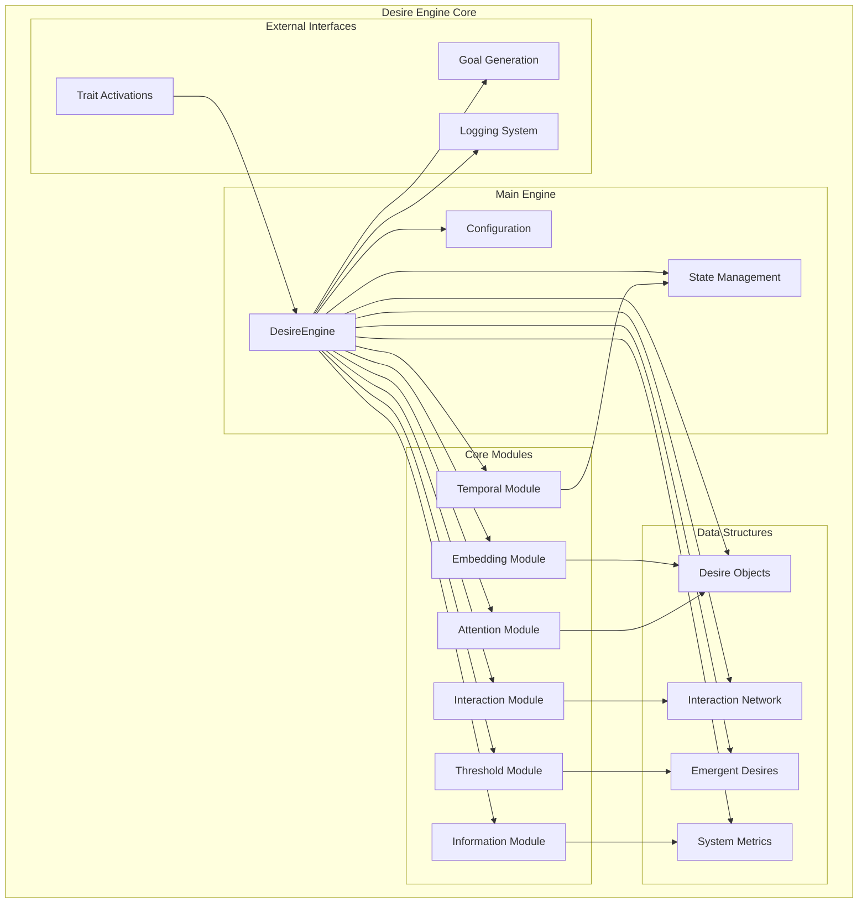

## Module Details

### 1. Core Engine Components

#### **DesireEngine (Main Controller)**
```python
class DesireEngine:
    - desires: Dict[str, Desire]
    - interaction_module: InteractionModule
    - threshold_module: ThresholdModule
    - embedding_module: EmbeddingModule
    - attention_module: AttentionModule
    - information_module: InformationModule
    - temporal_module: TemporalModule
```

#### **Configuration Management**
```python
class DesireEngineConfig:
    - interaction_threshold: float
    - synergy_threshold: float
    - emergent_threshold: float
    - conflict_threshold: float
    - decay_rate: float
    - reinforcement_rate: float
```

### 2. Processing Modules

#### **Interaction Module**


**Key Functions:**
- `process_interactions()`: Process all desire pairs
- `_calculate_interaction_strength()`: Compute synergy/conflict
- `_create_emergent_desire()`: Generate new emergent desires

#### **Threshold Module**
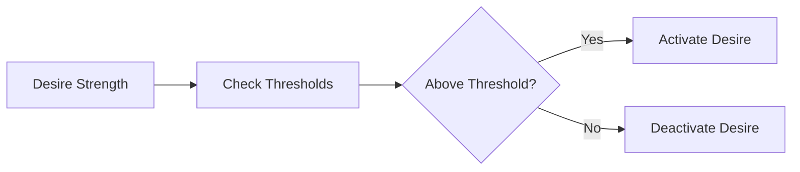

**Key Functions:**
- `apply_thresholds()`: Filter desires by strength
- `prune_weak_desires()`: Remove low-strength desires
- `reinforce_strong_desires()`: Boost high-strength desires

#### **Embedding Module**


**Key Functions:**
- `create_embeddings()`: Generate vector representations
- `compute_similarities()`: Calculate desire similarities
- `update_embeddings()`: Refresh embeddings

### 3. Data Structures

#### **Desire Object**
```python
@dataclass
class Desire:
    id: str
    name: str
    source_traits: List[str]
    strength: float
    base_strength: float
    reinforcement_count: int
    last_reinforcement: datetime
    emergent: bool = False
    parent_desires: List[str] = None
```

#### **Interaction Network**
```python
class InteractionNetwork:
    - interactions: Dict[Tuple[str, str], float]
    - emergent_desires: List[Desire]
    - synergy_matrix: np.ndarray
    - conflict_matrix: np.ndarray
```

### 4. Processing Pipeline

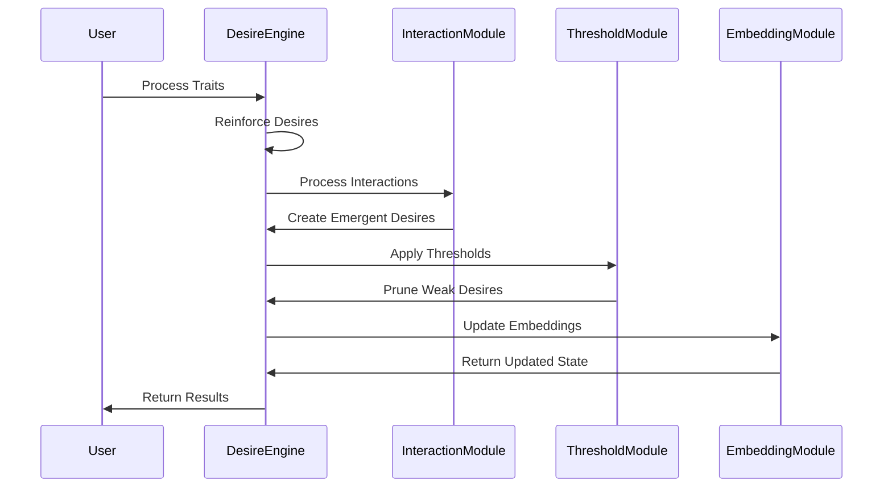

## Key Features

### 🎯 **Emergent Desire Creation**
- Automatic generation of new desires from interactions
- Synergy-based emergent behavior
- Hierarchical desire relationships

### 🔄 **Dynamic Processing**
- Real-time desire strength updates
- Adaptive threshold management
- Continuous interaction processing

### 📊 **Comprehensive Metrics**
- Entropy calculations
- Complexity measurements
- Stability tracking
- Network analysis

### 🧠 **Neural Integration**
- Embedding-based desire representation
- Attention mechanisms for focus
- Temporal processing for evolution

## File Structure

```
IlanyaDesireEngine/
├── desire_engine/
│   ├── __init__.py
│   ├── core.py              # Main engine
│   ├── config.py            # Configuration
│   ├── models.py            # Data models
│   └── modules/
│       ├── __init__.py
│       ├── attention.py     # Attention mechanisms
│       ├── embedding.py     # Embedding generation
│       ├── information.py   # Information processing
│       ├── interaction.py   # Interaction handling
│       ├── temporal.py      # Temporal processing
│       └── threshold.py     # Threshold management
├── requirements.txt
└── README.md
```

## Configuration Options

| Parameter | Default | Description |
|-----------|---------|-------------|
| `interaction_threshold` | 0.05 | Minimum interaction strength |
| `synergy_threshold` | 0.2 | Synergy detection threshold |
| `emergent_threshold` | 0.3 | Emergent desire creation threshold |
| `conflict_threshold` | 0.1 | Conflict detection threshold |
| `decay_rate` | 0.01 | Desire strength decay rate |
| `reinforcement_rate` | 0.1 | Reinforcement learning rate | 


# Ilanya Trait Engine - Architecture

## Engine Overview

```mermaid
graph TB
    subgraph "Trait Engine Core"
        subgraph "Main Engine"
            TE[TraitEngine]
            CONFIG[Configuration]
            STATE[State Management]
        end
        
        subgraph "Neural Network Components"
            TT[TraitTransformer]
            TE2[TraitEmbedding]
            PE[PositionalEncoding]
            ATT[Attention Layers]
        end
        
        subgraph "Data Models"
            TV[TraitVector]
            TM[TraitMatrix]
            TD[TraitData]
            TS[TraitState]
            CS[CognitiveState]
        end
        
        subgraph "Processing Pipeline"
            TP[Trait Processing]
            EV[Evolution Engine]
            PR[Prediction Engine]
            ST[State Tracking]
        end
        
        subgraph "External Interfaces"
            INPUT[Input Traits]
            OUTPUT[Processed Traits]
            EVOLUTION[Evolution Signals]
            LOGS[Logging System]
        end
    end
    
    %% Core connections
    TE --> CONFIG
    TE --> STATE
    TE --> TV
    TE --> TM
    TE --> TD
    TE --> TS
    TE --> CS
    
    %% Neural network connections
    TE --> TT
    TT --> TE2
    TT --> PE
    TT --> ATT
    
    %% Processing connections
    TE --> TP
    TE --> EV
    TE --> PR
    TE --> ST
    
    %% Data flow
    INPUT --> TE
    TE --> OUTPUT
    TE --> EVOLUTION
    TE --> LOGS
    
    %% Internal connections
    TP --> TV
    EV --> TS
    PR --> TD
    ST --> CS
```

## Component Details

### 1. Core Engine Components

#### **TraitEngine (Main Controller)**
```python
class TraitEngine:
    - neural_network: TraitTransformer
    - trait_states: Dict[TraitType, TraitState]
    - cognitive_state: CognitiveState
    - config: TraitEngineConfig
    - device: torch.device
```

#### **Configuration Management**
```python
class TraitEngineConfig:
    - embedding_dim: int
    - num_layers: int
    - num_heads: int
    - dropout: float
    - learning_rate: float
    - evolution_rate: float
```

### 2. Neural Network Architecture

#### **TraitTransformer**
```mermaid
graph TB
    subgraph "Transformer Architecture"
        A[Input Traits] --> B[TraitEmbedding]
        B --> C[PositionalEncoding]
        C --> D[Transformer Layers]
        D --> E[Output Projections]
        E --> F[Trait Predictions]
        E --> G[Evolution Signals]
    end
    
    subgraph "Transformer Layer"
        H[Multi-Head Attention]
        I[Add & Norm]
        J[Feed Forward]
        K[Add & Norm]
    end
    
    D --> H
    H --> I
    I --> J
    J --> K
```

**Key Components:**
- **TraitEmbedding**: Converts trait data to vector representations
- **PositionalEncoding**: Adds positional information to embeddings
- **Multi-Head Attention**: Processes trait relationships
- **Feed Forward Networks**: Non-linear transformations

#### **Embedding Process**
```mermaid
graph LR
    A[Trait Values] --> D[Combined Embedding]
    B[Trait Confidences] --> D
    C[Trait Indices] --> D
    D --> E[Layer Normalization]
    E --> F[Output Embeddings]
```

### 3. Data Structures

#### **TraitVector**
```python
@dataclass
class TraitVector:
    trait_type: TraitType
    value: float          # 0.0 to 1.0
    confidence: float     # 0.0 to 1.0
    
    def __post_init__(self):
        # Validation logic
        if not 0.0 <= self.value <= 1.0:
            raise ValueError("Trait value must be between 0 and 1")
```

#### **TraitMatrix**
```python
class TraitMatrix:
    traits: Dict[TraitType, TraitVector]
    interaction_matrix: np.ndarray
    metadata: Dict[str, Any]
```

#### **TraitState**
```python
@dataclass
class TraitState:
    trait_type: TraitType
    current_value: float
    previous_value: Optional[float]
    confidence: float
    change_rate: Optional[float]
    stability_score: float
```

#### **CognitiveState**
```python
@dataclass
class CognitiveState:
    trait_states: Dict[TraitType, TraitState]
    timestamp: datetime
    overall_stability: float
    cognitive_load: float
    attention_focus: float
    emotional_state: float
    processing_speed: float
    memory_availability: float
    decision_confidence: float
```

### 4. Processing Pipeline

```mermaid
sequenceDiagram
    participant User
    participant TraitEngine
    participant TraitTransformer
    participant EvolutionEngine
    participant StateTracker
    
    User->>TraitEngine: Process Traits
    TraitEngine->>TraitTransformer: Forward Pass
    TraitTransformer->>TraitEngine: Predictions & Signals
    TraitEngine->>EvolutionEngine: Apply Evolution
    EvolutionEngine->>TraitEngine: Evolved Traits
    TraitEngine->>StateTracker: Update States
    StateTracker->>TraitEngine: New Cognitive State
    TraitEngine->>User: Return Results
```

### 5. Evolution Engine

#### **Trait Evolution Process**
```mermaid
graph LR
    A[Current Traits] --> B[Experience Input]
    B --> C[Evolution Signals]
    C --> D[Apply Changes]
    D --> E[Validate Bounds]
    E --> F[Updated Traits]
```

**Evolution Factors:**
- **Experience**: External stimuli and events
- **Learning**: Knowledge acquisition and skill development
- **Stress**: Environmental pressure and challenges
- **Success**: Achievement and positive reinforcement

### 6. State Management

#### **State Tracking**
```mermaid
graph TB
    A[Initial State] --> B[Process Input]
    B --> C[Update Values]
    C --> D[Calculate Changes]
    D --> E[Update Stability]
    E --> F[New State]
    F --> G[Persist State]
```

## Key Features

### 🧠 **Neural Network Processing**
- Transformer-based architecture for complex trait relationships
- Multi-head attention for trait interaction modeling
- Embedding-based representation learning

### 🔄 **Dynamic Evolution**
- Real-time trait evolution based on experience
- Adaptive learning rates and evolution signals
- Bounded evolution within valid ranges

### 📊 **Comprehensive State Tracking**
- Detailed trait state history
- Cognitive state monitoring
- Stability and change rate calculations

### 🎯 **Prediction Capabilities**
- Trait value predictions
- Confidence estimation
- Evolution signal generation

## File Structure

```
IlanyaTraitEngine/
├── src/
│   ├── __init__.py
│   ├── trait_engine/
│   │   ├── __init__.py
│   │   └── trait_engine.py
│   ├── trait_models/
│   │   ├── __init__.py
│   │   ├── trait_data.py
│   │   ├── trait_state.py
│   │   └── trait_types.py
│   ├── neural_networks/
│   │   ├── __init__.py
│   │   └── trait_transformer.py
│   └── utils/
├── configs/
│   └── default_config.yaml
├── models/
│   ├── ilanya_trait_model.pt
│   └── ilanya_trait_config.yaml
├── examples/
│   ├── basic_usage.py
│   ├── full_system_demo.py
│   └── train_and_save_model.py
└── requirements.txt
```

## Configuration Options

| Parameter | Default | Description |
|-----------|---------|-------------|
| `embedding_dim` | 64 | Embedding dimension |
| `num_layers` | 2 | Number of transformer layers |
| `num_heads` | 4 | Number of attention heads |
| `dropout` | 0.1 | Dropout rate |
| `learning_rate` | 1e-4 | Learning rate for training |
| `evolution_rate` | 0.01 | Trait evolution rate |

## Trait Types

### **Core Personality Traits**
- **OPENNESS**: Openness to experience
- **CONSCIENTIOUSNESS**: Conscientiousness
- **EXTRAVERSION**: Extraversion
- **AGREEABLENESS**: Agreeableness
- **NEUROTICISM**: Neuroticism

### **Cognitive Traits**
- **CREATIVITY**: Creative thinking
- **ADAPTABILITY**: Adaptability to change
- **LEARNING_RATE**: Learning speed
- **MEMORY**: Memory capacity
- **ATTENTION**: Attention span

### **Behavioral Traits**
- **SOCIAL_SKILLS**: Social interaction ability
- **LEADERSHIP**: Leadership qualities
- **EMPATHY**: Empathetic understanding
- **RESILIENCE**: Stress resilience
- **CURIOSITY**: Curiosity and exploration 

# Ilanya Test Suite - Architecture

## System Overview

```mermaid
graph TB
    subgraph "Test Suite Core"
        subgraph "Test Runner"
            TR[run_tests.py]
            TR2[Test Runner]
            SUMMARY[Summary Reporter]
        end
        
        subgraph "Test Categories"
            DE_TESTS[Desire Engine Tests]
            TE_TESTS[Trait Engine Tests]
            INT_TESTS[Integration Tests]
        end
        
        subgraph "Demo Suite"
            DE_DEMOS[Desire Engine Demos]
            TE_DEMOS[Trait Engine Demos]
            DEMO_RUNNER[Demo Runner]
        end
        
        subgraph "Testing Framework"
            PYTEST[pytest]
            UNITTEST[unittest]
            LOGGING[Logging Integration]
        end
    end
    
    subgraph "Test Components"
        subgraph "Desire Tests"
            ED[Emergent Desires]
            IN[Interaction Networks]
            TH[Threshold Management]
            EM[Embedding Tests]
        end
        
        subgraph "Trait Tests"
            TT[Trait Types]
            TD[Trait Data]
            TS[Trait State]
            NN[Neural Networks]
        end
    end
    
    subgraph "External Systems"
        DE[Desire Engine]
        TE[Trait Engine]
        LOGS[Logging System]
    end
    
    %% Test Runner connections
    TR --> TR2
    TR2 --> SUMMARY
    TR2 --> DE_TESTS
    TR2 --> TE_TESTS
    TR2 --> INT_TESTS
    TR2 --> DE_DEMOS
    TR2 --> TE_DEMOS
    
    %% Test Framework connections
    DE_TESTS --> PYTEST
    TE_TESTS --> PYTEST
    INT_TESTS --> UNITTEST
    DE_DEMOS --> UNITTEST
    TE_DEMOS --> UNITTEST
    
    %% Test Components
    DE_TESTS --> ED
    DE_TESTS --> IN
    DE_TESTS --> TH
    DE_TESTS --> EM
    
    TE_TESTS --> TT
    TE_TESTS --> TD
    TE_TESTS --> TS
    TE_TESTS --> NN
    
    %% External connections
    DE_TESTS --> DE
    TE_TESTS --> TE
    DE_DEMOS --> DE
    TE_DEMOS --> TE
    DE_TESTS --> LOGS
    TE_TESTS --> LOGS
```

## Component Details

### 1. Test Runner Architecture

#### **Main Test Runner (run_tests.py)**
```python
class TestRunner:
    def run_desire_engine_tests() -> Tuple[bool, int, int, int]
    def run_trait_engine_tests() -> Tuple[bool, int, int, int]
    def run_demos() -> Tuple[bool, int, int, int]
    def generate_summary() -> str
```

**Key Features:**
- Orchestrates all test execution
- Provides detailed reporting
- Integrates with logging system
- Handles both pytest and unittest

#### **Test Execution Flow**
```mermaid
sequenceDiagram
    participant Runner
    participant DesireTests
    participant TraitTests
    participant Demos
    participant Logger
    
    Runner->>Logger: Initialize logging
    Runner->>DesireTests: Run desire tests
    DesireTests->>Logger: Log test results
    Runner->>TraitTests: Run trait tests
    TraitTests->>Logger: Log test results
    Runner->>Demos: Run demos
    Demos->>Logger: Log demo results
    Runner->>Runner: Generate summary
    Runner->>Logger: Log final summary
```

### 2. Test Categories

#### **Desire Engine Tests**
```python
class TestEmergentDesires(unittest.TestCase):
    def test_emergent_desire_creation()
    def test_emergent_desire_logging()
    def test_emergent_desire_persistence()
    def test_emergent_desire_threshold()
    def test_interaction_results_structure()

class TestInteractionModule(unittest.TestCase):
    def test_calculate_interaction_strength()
    def test_create_emergent_desire()
```

**Test Coverage:**
- Emergent desire creation and validation
- Interaction network processing
- Threshold management
- State persistence
- Logging verification

#### **Trait Engine Tests**
```python
class TestTraitTypes:
    def test_trait_type_enum()
    def test_trait_categories()
    def test_trait_dimensions()

class TestTraitData:
    def test_trait_vector_creation()
    def test_trait_vector_validation()
    def test_trait_matrix_creation()
    def test_trait_data_builder()

class TestTraitState:
    def test_trait_state_creation()
    def test_cognitive_state_creation()

class TestNeuralNetworkComponents:
    def test_trait_embedding()
    def test_positional_encoding()
```

**Test Coverage:**
- Trait type definitions and enums
- Data structure validation
- State management
- Neural network components

### 3. Demo Suite

#### **Demo Architecture**
```mermaid
graph LR
    subgraph "Demo Suite"
        DR[Demo Runner]
        DD[Desire Demos]
        TD[Trait Demos]
    end
    
    subgraph "Demo Types"
        MD[Modular Desire Engine]
        ST[Simple Trait Engine]
    end
    
    DR --> DD
    DR --> TD
    DD --> MD
    TD --> ST
```

#### **Demo Components**
```python
# Desire Engine Demo
def modular_desire_engine_demo():
    - Initialize desire engine
    - Create sample trait states
    - Process multiple iterations
    - Generate emergent desires
    - Compute embeddings and attention

# Trait Engine Demo
def simple_trait_engine_demo():
    - Initialize trait engine
    - Create sample traits
    - Process through neural network
    - Demonstrate evolution
    - Run multiple cycles
```

### 4. Testing Framework Integration

#### **pytest Integration**
```python
# For trait engine tests
import pytest

class TestTraitTypes:
    @classmethod
    def setup_class(cls):
        cls.logger = setup_logger(...)
    
    def test_trait_type_enum(self):
        assert TraitType.OPENNESS.value == "openness"
        # ... more assertions
```

#### **unittest Integration**
```python
# For desire engine tests
import unittest

class TestEmergentDesires(unittest.TestCase):
    def setUp(self):
        self.config = DesireEngineConfig(...)
        self.desire_engine = DesireEngine(self.config)
    
    def test_emergent_desire_creation(self):
        # ... test implementation
        self.assertEqual(emergent_count, 1)
```

### 5. Logging Integration

#### **Test Logging Pattern**
```python
def test_example():
    start_time = time.time()
    log_test_start(logger, "test_name", "Test description")
    
    try:
        # Test implementation
        assert result == expected
        log_test_end(logger, "test_name", True, duration)
    except Exception as e:
        log_test_end(logger, "test_name", False, duration)
        raise
```

#### **Demo Logging Pattern**
```python
def demo_example():
    start_time = time.time()
    log_demo_start(logger, "demo_name", "Demo description")
    
    try:
        # Demo implementation
        log_demo_end(logger, "demo_name", duration)
    except Exception as e:
        logger.error(f"Demo failed: {str(e)}")
        log_demo_end(logger, "demo_name", duration)
        raise
```

## File Structure

```
Tests/
├── run_tests.py                    # Main test runner
├── test_emergent_desires.py        # Desire engine tests
├── test_trait_engine.py            # Trait engine tests
└── Logs/                           # Test-specific logs
    ├── desire/
    │   └── tests/
    └── trait/
        └── tests/
```

## Test Execution Flow

### 1. Test Runner Process
```mermaid
graph TD
    A[Start Test Runner] --> B[Initialize Logging]
    B --> C[Run Desire Tests]
    C --> D[Run Trait Tests]
    D --> E[Run Demos]
    E --> F[Generate Summary]
    F --> G[Display Results]
    G --> H[Exit]
```

### 2. Individual Test Process
```mermaid
graph TD
    A[Test Start] --> B[Setup Environment]
    B --> C[Execute Test Logic]
    C --> D{Test Passed?}
    D -->|Yes| E[Log Success]
    D -->|No| F[Log Failure]
    E --> G[Cleanup]
    F --> G
    G --> H[Test End]
```

## Configuration Options

### **Test Configuration**
```python
# Test runner configuration
TEST_CONFIG = {
    'desire_tests': True,
    'trait_tests': True,
    'demos': True,
    'verbose': True,
    'stop_on_failure': False
}
```

### **Framework Selection**
| Test Type | Framework | Reason |
|-----------|-----------|--------|
| Trait Tests | pytest | Better floating-point handling |
| Desire Tests | unittest | Legacy compatibility |
| Demos | unittest | Simple execution model |

## Key Features

### 🧪 **Comprehensive Coverage**
- Unit tests for all components
- Integration tests for engine interactions
- Demo validation for system behavior

### 📊 **Detailed Reporting**
- Test success/failure counts
- Execution duration tracking
- Detailed error reporting
- Summary generation

### 🔄 **Automated Execution**
- Single command test execution
- Automated demo running
- Continuous integration ready

### 📝 **Structured Logging**
- Test-specific log files
- Execution trace preservation
- Error context maintenance

## Test Results Example

```
🚀 Ilanya Test Runner
==================================================
Started at: 2025-06-29 16:55:15

🧪 Running Tests...
------------------------------
📊 Test Results:
  Desire Engine: 5 tests, 0 failures, 0 errors
  Trait Engine: 11 tests, 0 failures, 0 errors
  Total: 16 tests, 0 failures, 0 errors

🎬 Running Demos...
------------------------------
📊 Demo Results:
  Completed: 2/2 demos

🎯 Overall Summary:
  Tests: ✅ PASSED
  Demos: ✅ PASSED
  Overall: ✅ PASSED
  Duration: 10.11 seconds
```

## Benefits

### 🔍 **Quality Assurance**
- Automated validation of all components
- Regression testing capabilities
- Performance benchmarking

### 🛠️ **Development Support**
- Rapid feedback on changes
- Debugging assistance
- Documentation through tests

### 📈 **Monitoring**
- System health tracking
- Performance regression detection
- Feature validation

### 🚀 **Deployment Confidence**
- Pre-deployment validation
- Integration verification
- System behavior confirmation 