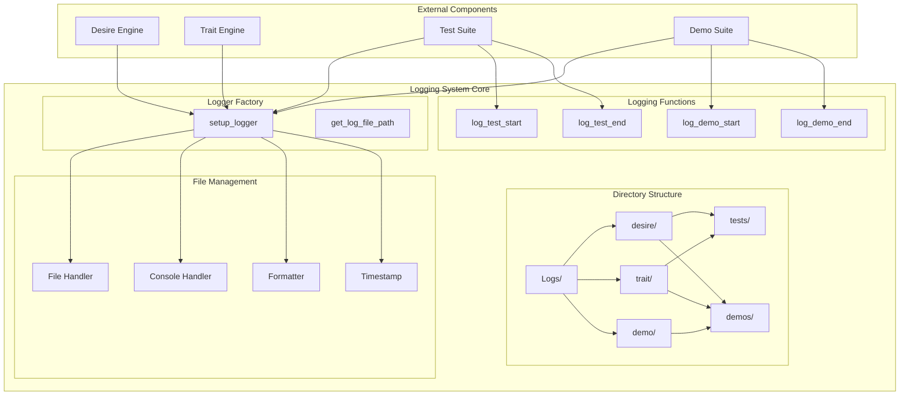
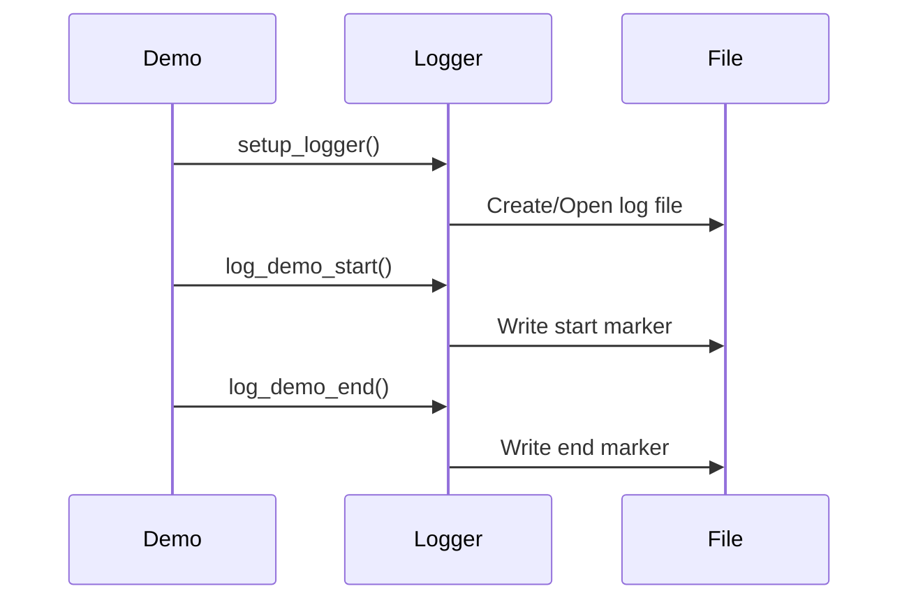

# Ilanya Logging System - Architecture

## System Overview



## Component Details

### 1. Core Logging Functions

#### **setup_logger()**
```python
def setup_logger(
    engine_type: str,      # 'trait' or 'desire'
    test_type: str,        # 'test' or 'demo'
    test_name: str,        # Name of test/demo
    test_target: str,      # What is being tested
    log_level: str = "INFO",
    log_dir: str = "Logs"
) -> logging.Logger
```

**Key Features:**
- Creates persistent log files (append mode)
- Organizes logs by engine type and test type
- Provides both file and console output
- Includes run separators for multiple executions

#### **Logging Functions**
```python
def log_test_start(logger, test_name: str, test_description: str)
def log_test_end(logger, test_name: str, success: bool, duration: float)
def log_demo_start(logger, demo_name: str, demo_description: str)
def log_demo_end(logger, demo_name: str, duration: float)
```

### 2. Directory Structure

#### **Organized Log Layout**
```
Logs/
├── desire/
│   ├── tests/
│   │   ├── test_emergent_desires_interaction_networks.log
│   │   ├── test_test_suite_all_modules.log
│   │   └── test_logging_test_system_verification.log
│   └── demos/
│       └── demo_modular_desire_engine_emergent_desires.log
├── trait/
│   ├── tests/
│   │   ├── test_trait_types_enum_definitions.log
│   │   ├── test_trait_data_data_structures.log
│   │   └── test_trait_state_state_management.log
│   └── demos/
│       └── demo_simple_trait_engine_neural_network.log
└── demo/
    └── demos/
        └── demo_demo_suite_all_demos.log
```

### 3. File Naming Convention

#### **Standardized Format**
```
{test_type}_{test_name}_{test_target}.log
```

**Examples:**
- `test_emergent_desires_interaction_networks.log`
- `demo_modular_desire_engine_emergent_desires.log`
- `test_trait_types_enum_definitions.log`

### 4. Log Format

#### **Standard Log Entry**
```
2025-06-29 16:55:16 - desire_test_emergent_desires - INFO - Logger initialized for desire test: emergent_desires - interaction_networks
```

**Format Components:**
- **Timestamp**: `YYYY-MM-DD HH:MM:SS`
- **Logger Name**: `{engine_type}_{test_type}_{test_name}`
- **Log Level**: `INFO`, `DEBUG`, `WARNING`, `ERROR`
- **Message**: Descriptive log message

#### **Test Run Separator**
```
================================================================================
NEW TEST RUN - 2025-06-29 17:00:06
Logger initialized for trait test: test_persistent - logging_test
Log file: Logs/trait/tests/test_test_persistent_logging_test.log
================================================================================
```

### 5. Usage Patterns

#### **Test Suite Integration**


#### **Demo Integration**


### 6. Configuration Options

#### **Log Levels**
| Level | Description | Usage |
|-------|-------------|-------|
| `DEBUG` | Detailed debugging information | Development and troubleshooting |
| `INFO` | General information messages | Normal operation tracking |
| `WARNING` | Warning messages | Potential issues |
| `ERROR` | Error messages | Actual problems |

#### **Directory Configuration**
```python
# Default directory structure
log_dir = "Logs"
engine_types = ["desire", "trait", "demo"]
test_types = ["test", "demo"]
```

### 7. File Management

#### **Persistent Logging**
- **Append Mode**: New runs add to existing files
- **Run Separators**: Clear markers between different executions
- **Timestamp Tracking**: Each run is timestamped
- **File Rotation**: Optional log rotation for large files

#### **Handler Configuration**
```python
# File Handler (Append Mode)
file_handler = logging.FileHandler(file_path, mode='a')

# Console Handler
console_handler = logging.StreamHandler()

# Formatter
formatter = logging.Formatter(
    '%(asctime)s - %(name)s - %(levelname)s - %(message)s',
    datefmt='%Y-%m-%d %H:%M:%S'
)
```

## Key Features

### 📁 **Organized Structure**
- Hierarchical directory organization
- Clear separation by engine and test type
- Consistent naming conventions

### 🔄 **Persistent Logging**
- Accumulates logs across multiple runs
- Clear run separators
- Maintains history of all executions

### 📊 **Comprehensive Coverage**
- Test execution tracking
- Demo performance monitoring
- Engine operation logging
- Error and warning capture

### 🎯 **Easy Navigation**
- Standardized file names
- Clear directory structure
- Timestamp-based organization

## Integration Examples

### **Test Integration**
```python
# In test files
logger = setup_logger(
    engine_type="desire",
    test_type="test", 
    test_name="emergent_desires",
    test_target="interaction_networks"
)

log_test_start(logger, "test_name", "Test description")
# ... test execution ...
log_test_end(logger, "test_name", success=True, duration=1.23)
```

### **Demo Integration**
```python
# In demo files
logger = setup_logger(
    engine_type="trait",
    test_type="demo",
    test_name="simple_trait_engine", 
    test_target="neural_network"
)

log_demo_start(logger, "demo_name", "Demo description")
# ... demo execution ...
log_demo_end(logger, "demo_name", duration=5.67)
```

### **Engine Integration**
```python
# In engine files
logger = setup_logger(
    engine_type="desire",
    test_type="test",
    test_name="desire_engine",
    test_target="core_processing"
)

logger.info("Processing desires...")
logger.debug("Desire count: 15")
logger.warning("Low interaction strength detected")
logger.error("Failed to create emergent desire")
```

## Benefits

### 🔍 **Debugging Support**
- Detailed execution traces
- Error context preservation
- Performance timing data

### 📈 **Monitoring Capabilities**
- System health tracking
- Performance metrics
- Usage patterns analysis

### 🛠️ **Development Workflow**
- Test result verification
- Demo output validation
- System behavior analysis

### 📚 **Documentation**
- Execution history
- System evolution tracking
- Performance benchmarks 