# Ilanya - Bidirectional Integration Architecture 🔄✨

## 🎯 Integration Overview

The Ilanya system now features a **bidirectional connection** between the Desire Engine and Trait Engine, creating a sophisticated feedback loop where:

- **🧬 Traits → 💭 Desires**: Trait activations create and reinforce desires
- **💭 Desires → 🧬 Traits**: Desire reinforcement strengthens source traits
- **🔧 Modular Design**: Both engines remain independent and modular

## 🏗️ Complete Integration Architecture

```mermaid
graph TB
    subgraph "🌟 Ilanya Integrated AI System"
        subgraph "🧬 Trait Engine"
            TE[🧬 Trait Engine<br/>Neural Controller]
            TT[🤖 Trait Transformer<br/>Neural Network]
            TE2[🔢 Trait Embedding<br/>Vector Encoding]
            PE[📍 Positional Encoding<br/>Sequence Awareness]
            ATT[🎯 Attention Layers<br/>Multi-Head Processing]
            EV[🌱 Evolution Engine<br/>Trait Adaptation]
            TS[📈 State Tracker<br/>Change Monitoring]
        end
        
        subgraph "💭 Desire Engine"
            DE[💭 Desire Engine<br/>Core Controller]
            IM[🔄 Interaction Module<br/>Synergy & Conflict]
            TM[⚖️ Threshold Module<br/>Strength Filtering]
            EM[🧩 Embedding Module<br/>Vector Representations]
            AM[👁️ Attention Module<br/>Focus Management]
            IM2[📊 Information Module<br/>Metrics & Analytics]
            TEM[⏰ Temporal Module<br/>Time-based Processing]
        end
        
        subgraph "🔗 Integration Layer"
            EI[🔗 Engine Integration<br/>Bidirectional Bridge]
            IC[⚙️ Integration Config<br/>Settings & Parameters]
            RM[📋 Reinforcement Manager<br/>Trait-Desire Mapping]
            RH[📊 Reinforcement History<br/>Learning Records]
            SM[💾 State Manager<br/>Integration State]
        end
        
        subgraph "📊 Data Flow"
            TD[🧬 Trait Data<br/>Neural Outputs]
            DD[💭 Desire Data<br/>Desire Objects]
            ID[🔗 Integration Data<br/>Mappings & History]
            MD[📈 Metrics Data<br/>System Analytics]
        end
        
        subgraph "🎮 External Interfaces"
            API[🔌 REST API<br/>External Integration]
            CLI[💻 CLI Interface<br/>Command Line Tools]
            WEB[🌐 Web Interface<br/>Dashboard & Controls]
            DB[🗄️ Database<br/>Persistent Storage]
        end
    end
    
    %% 🎨 Bidirectional Connections
    TE <--> EI
    DE <--> EI
    
    %% Data Flow Connections
    TE --> TD
    DE --> DD
    EI --> ID
    EI --> MD
    
    %% Integration Layer Internal Connections
    EI --> IC
    EI --> RM
    EI --> RH
    EI --> SM
    
    %% Engine Internal Connections
    TE --> TT
    TT --> TE2
    TT --> PE
    TT --> ATT
    TE --> EV
    TE --> TS
    
    DE --> IM
    DE --> TM
    DE --> EM
    DE --> AM
    DE --> IM2
    DE --> TEM
    
    %% External Connections
    API --> EI
    CLI --> EI
    WEB --> EI
    DB --> SM
```



## 🔄 Bidirectional Data Flow

```mermaid
flowchart TD
    subgraph "🧬 Trait Engine Processing"
        A[🎯 Raw Trait Data<br/>Personality Values] --> B[🤖 Neural Network<br/>Transformer Model]
        B --> C[🌱 Evolution Engine<br/>Trait Adaptation]
        C --> D[📈 State Tracker<br/>Change Monitoring]
        D --> E[🧬 Processed Trait Data<br/>Ready for Integration]
    end
    
    subgraph "🔗 Integration Processing"
        E --> F[🔗 Engine Integration<br/>Trait → Desire Conversion]
        F --> G[🎯 Desire Creation<br/>New Desires from Traits]
        F --> H[💪 Desire Reinforcement<br/>Strengthen Existing Desires]
        
        I[💭 Desire Reinforcement<br/>External Stimulus] --> J[🔗 Engine Integration<br/>Desire → Trait Conversion]
        J --> K[🧬 Trait Reinforcement<br/>Strengthen Source Traits]
    end
    
    subgraph "💭 Desire Engine Processing"
        G --> L[🔄 Interaction Module<br/>Synergy Detection]
        H --> L
        L --> M[🌟 Emergent Creator<br/>New Desires]
        M --> N[⚖️ Threshold Filter<br/>Strength Management]
        N --> O[🧩 Embedding Updater<br/>Vector Refresh]
        O --> P[💭 Processed Desire Data<br/>Ready for Integration]
    end
    
    subgraph "🔄 Feedback Loop"
        K --> Q[🔄 Trait Evolution<br/>Reinforced Traits]
        Q --> R[📊 Updated Trait Data<br/>Back to Trait Engine]
        R --> A
    end
    
    %% 🎨 Beautiful Flow Connections
    P --> I
    E --> F
    I --> J
    K --> Q
```



## 🎮 Integration Module Details

### **EngineIntegration Class**

```python
class EngineIntegration:
    """
    Bidirectional integration between Desire Engine and Trait Engine.
    
    Key Features:
    - Traits → Desires: Trait activations create/reinforce desires
    - Desires → Traits: Desire reinforcement strengthens source traits
    - Modular Design: Clean separation of concerns
    """
    
    def __init__(self, config: IntegrationConfig):
        # Integration configuration
        self.config = config
        
        # Engine references
        self.desire_engine = None
        self.trait_engine = None
        
        # Integration state
        self.trait_desire_mapping: Dict[str, List[str]] = {}
        self.desire_trait_mapping: Dict[str, List[str]] = {}
        self.reinforcement_history: List[Dict[str, Any]] = []
        
        # Statistics tracking
        self.stats = {
            'desires_created': 0,
            'desires_reinforced': 0,
            'traits_reinforced': 0,
            'integration_cycles': 0
        }
```

### **Integration Configuration**

```python
@dataclass
class IntegrationConfig:
    """Configuration for engine integration."""
    
    # Integration parameters
    reinforcement_strength: float = 0.1  # How much desires reinforce traits
    trait_activation_threshold: float = 0.05  # Minimum trait change to create desire
    desire_reinforcement_threshold: float = 0.3  # Minimum desire strength to reinforce traits
    
    # Trait protection
    protected_traits: List[str] = [
        "sexual_orientation", "gender_identity", "core_values"
    ]
    
    # Logging and performance
    log_integration_events: bool = True
    batch_size: int = 10
    max_desires_per_trait: int = 3
```

## 🔄 Integration Workflow

```mermaid
sequenceDiagram
    participant 🧬 TraitEngine
    participant 🔗 Integration
    participant 💭 DesireEngine
    participant 📊 Logger
    
    Note over 🧬 TraitEngine,📊 Logger: Trait → Desire Flow
    
    🧬 TraitEngine->>🔗 Integration: process_trait_activations(trait_data)
    🔗 Integration->>🔗 Integration: Convert trait data to states
    🔗 Integration->>💭 DesireEngine: process_trait_activations(trait_states)
    💭 DesireEngine->>💭 DesireEngine: Create/reinforce desires
    💭 DesireEngine->>🔗 Integration: Return processing results
    🔗 Integration->>🔗 Integration: Update trait-desire mappings
    🔗 Integration->>📊 Logger: Log integration cycle
    
    Note over 🧬 TraitEngine,📊 Logger: Desire → Trait Flow
    
    💭 DesireEngine->>🔗 Integration: process_desire_reinforcement(desire_id, strength)
    🔗 Integration->>🔗 Integration: Get desire and source traits
    🔗 Integration->>🔗 Integration: Calculate trait reinforcement
    🔗 Integration->>🧬 TraitEngine: Apply trait reinforcement
    🧬 TraitEngine->>🧬 TraitEngine: Update trait values
    🔗 Integration->>📊 Logger: Log reinforcement event
    🔗 Integration->>💭 DesireEngine: Return reinforcement results
```



## 📊 Integration Metrics

### **System Statistics**

| Metric | Description | Tracking |
|--------|-------------|----------|
| **Integration Cycles** | Number of trait→desire processing cycles | `stats['integration_cycles']` |
| **Desires Created** | Total desires created from traits | `stats['desires_created']` |
| **Desires Reinforced** | Total desire reinforcement events | `stats['desires_reinforced']` |
| **Traits Reinforced** | Total trait reinforcement events | `stats['traits_reinforced']` |

### **Mapping Relationships**

```python
# Trait → Desire Mapping
trait_desire_mapping = {
    "openness": ["desire_1", "desire_5"],
    "creativity": ["desire_2", "desire_6"],
    "empathy": ["desire_3"],
    "learning_rate": ["desire_4"]
}

# Desire → Trait Mapping (Reverse)
desire_trait_mapping = {
    "desire_1": ["openness"],
    "desire_2": ["creativity"],
    "desire_3": ["empathy"],
    "desire_4": ["learning_rate"],
    "desire_5": ["openness"],
    "desire_6": ["creativity"]
}
```

## 🛡️ Trait Protection System

### **Protected Traits**

The integration system includes a **trait protection mechanism** to prevent modification of core identity traits:

```python
protected_traits = [
    "sexual_orientation",    # Core sexual identity
    "gender_identity",       # Core gender identity
    "core_values",          # Fundamental values
    "moral_framework",      # Core moral beliefs
    "ethical_principles"    # Fundamental ethics
]
```

### **Protection Levels**

| Protection Level | Description | Examples |
|-----------------|-------------|----------|
| **🛡️ Permanently Protected** | Never change, core identity | Sexual orientation, gender identity |
| **🔄 Partially Protected** | Can grow but not change fundamentally | Identity expression traits |
| **🌱 Fully Evolvable** | Can change freely | Personality, cognitive, behavioral traits |

## 🎯 Key Features

### **🧬 Traits → 💭 Desires**
- **Automatic Creation**: Positive trait changes create new desires
- **Reinforcement**: Existing desires are strengthened by trait activations
- **Threshold Filtering**: Only significant trait changes create desires
- **Mapping Tracking**: Maintains relationships between traits and desires

### **💭 Desires → 🧬 Traits**
- **Source Reinforcement**: Desires reinforce the traits that created them
- **Strength Scaling**: Reinforcement strength scales with desire properties
- **Protection Respect**: Protected traits are never modified
- **History Tracking**: All reinforcement events are logged

### **🔧 Modular Design**
- **Clean Separation**: Both engines remain independent
- **Configurable Integration**: Integration parameters are easily adjustable
- **State Persistence**: Integration state can be saved and loaded
- **Comprehensive Logging**: All integration events are logged

## 🚀 Usage Examples

### **Basic Integration Setup**

```python
from utils.engine_integration import create_integrated_system, IntegrationConfig

# Create engines
desire_engine = DesireEngine()
trait_engine = TraitEngine()

# Configure integration
config = IntegrationConfig(
    reinforcement_strength=0.15,
    trait_activation_threshold=0.03,
    desire_reinforcement_threshold=0.2
)

# Create integrated system
integration = create_integrated_system(desire_engine, trait_engine, config)
```

### **Processing Trait Activations**

```python
# Process trait data through integration
trait_data = create_sample_trait_data()
results = integration.process_trait_activations(trait_data)

# Check results
print(f"Created {len(desire_engine.desires)} desires")
print(f"Active desires: {list(desire_engine.desires.keys())}")
```

### **Processing Desire Reinforcement**

```python
# Reinforce a desire
desire_id = "desire_1"
reinforcement_strength = 0.5
results = integration.process_desire_reinforcement(desire_id, reinforcement_strength)

# Check reinforcement results
print(f"Reinforced traits: {results['reinforced_traits']}")
print(f"Total reinforcement: {results['strength']}")
```

## 📈 Performance Considerations

### **Optimization Features**
- **Batch Processing**: Configurable batch sizes for efficiency
- **Threshold Filtering**: Only process significant changes
- **Mapping Caching**: Efficient trait-desire relationship tracking
- **State Persistence**: Save/load integration state for continuity

### **Scalability**
- **Modular Architecture**: Easy to extend and modify
- **Configurable Parameters**: Adjust behavior without code changes
- **Comprehensive Logging**: Monitor system performance
- **Memory Efficient**: Minimal overhead for integration layer

---

*🎨 This bidirectional integration creates a sophisticated feedback loop where traits and desires continuously influence each other, leading to emergent behaviors and dynamic personality evolution while maintaining full modularity and protection of core identity traits!* ✨🚀 